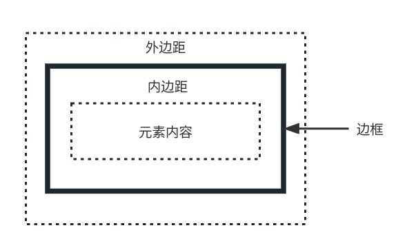
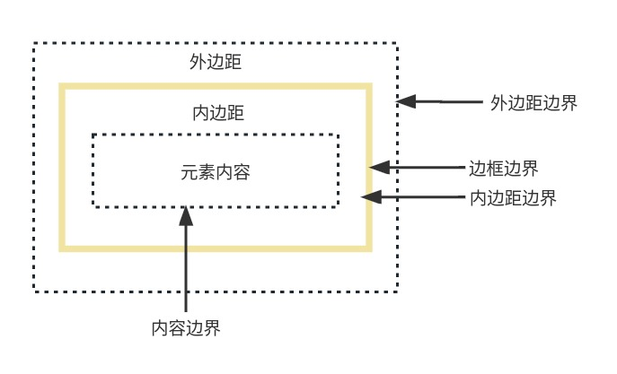
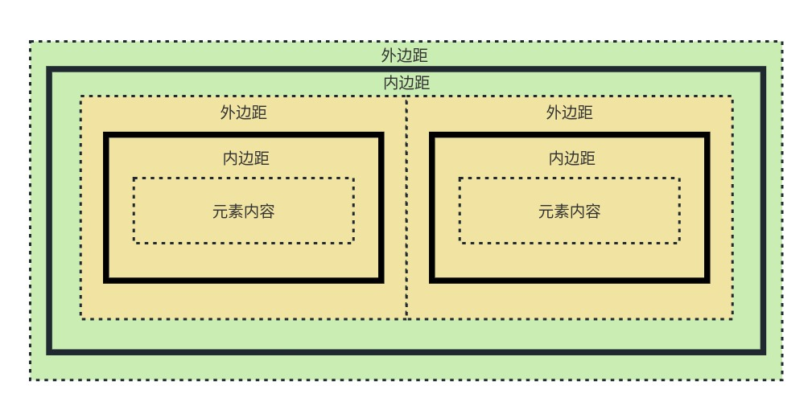

CSS 中的一个基本且重要的概念就是**盒模型**（box model），它对于 HTML 文档的排版很重要。

HTML 文档是由**元素组成的**，而**每一个元素都是一个盒子**，一个盒子由四部分组成，如下图所示：

这四个部分就如上图所示：元素内容、内边距、边框和外边距。

其中**元素内容**和**边框**对用户来说是可见的（边框可能需要设置属性才能看到），而内边距和外边距则是不可见的，但却会实实在在占据着一部分空间。

另外，由于有边框的存在，而边框又是由宽度的，所以实际上整个盒模型的长宽还要考虑边框宽度的影响，具体的影响即参考下图：

所以我们可以得出，实际的`长 = 左外边距 + 右外边距 + 左内边距 + 右内边距 + 左边框宽度 + 右边框宽度`；

而实际的`宽 = 上外边距 + 下外边距 + 上内边距 + 下内边距 + 上边框宽度 + 下边框宽度`。

****

另外，在 HTML 中我们知道一个元素还可以包含其他元素，这种情况下，父元素的内容盒子称为子元素的**块容器**（container block），通常称为**容器**。

在默认情况下，它们之间的关系如下图所示：

实际上理解不同层级之间元素的盒子之间的关系把握住两点就行了：

1. 同级元素的盒子之间没有任何间隔（默认情况下横向排列）
2. 所有一级子元素构成的整个盒子作为其直接父元素的元素内容部分