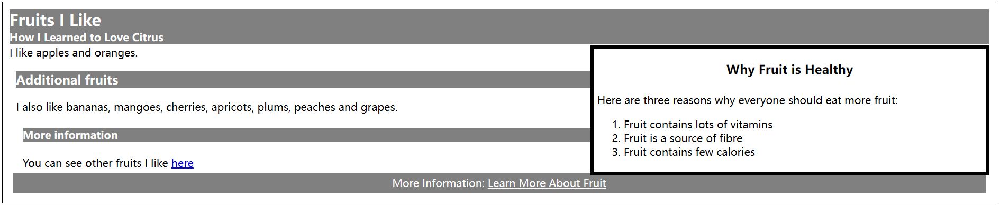

# 一. aside元素

`aside`元素用来表示跟周边内容稍沾一点边的内容，类似于书籍或杂志中的侧栏。其内容与页面其他内容、`article`或`section`有点关系，但并非主体内容的一部分。它可能是一些背景信息、到相关文章的连接，诸如此类。

## 1. 元素信息

| 元素  | 元素类型 | 允许具有的父元素                                             | 局部属性 | 内容              | 标签用法           |
| ----- | -------- | ------------------------------------------------------------ | -------- | ----------------- | ------------------ |
| aside | 流       | 任何可以包含流元素的元素，但该元素不能是address元素的后代元素 | 无       | style元素和流内容 | 开始标签和结束标签 |

| 是否为HTML5新增 | 在HTML5中的变化 | 习惯样式                                          |
| --------------- | --------------- | ------------------------------------------------- |
| 是              | 无              | <pre><code>aside { display: block; }</code></pre> |

## 2. 使用元素

```html
<article>
    <header>
        <hgroup>
            <h1 id="fruitsilike">Fruits I Like</h1>
            <h2>How I Learned to Love Citrus</h2>
        </hgroup>
    </header>
    <aside>
        <h1>Why Fruit is Healthy</h1>
        <section>
            Here are three reasons why everyone should eat more fruit:
            <ol>
                <li>Fruit contains lots of vitamins</li>
                <li>Fruit is a source of fibre</li>
                <li>Fruit contains few calories</li>
            </ol>
        </section>
    </aside>
    I like apples and oranges.            
    <section>
        <h1 id="morefruit">Additional fruits</h1>
        I also like bananas, mangoes, cherries, apricots, plums,
        peaches and grapes.
        <section>            
            <h1>More information</h1>
            You can see other fruits I like <a href="fruitlist.html">here</a>
        </section>
    </section>
    <footer>
        <nav>
            More Information:
            <a href="http://fruit.org">Learn More About Fruit</a>
        </nav>
    </footer>
</article>
```

其渲染效果如下图所示：



