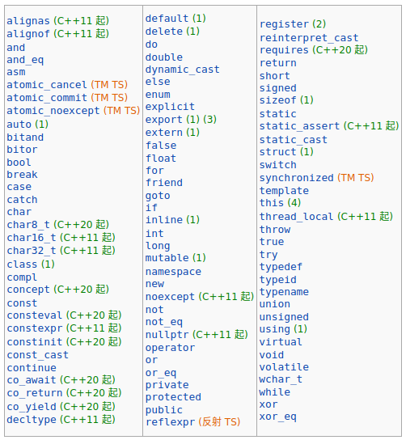
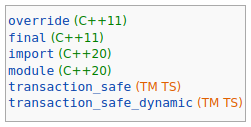

# 一. 命名规则

**标识符**就是一个名字，可以用来标识：对象、引用、函数、枚举项、类型、类成员、命名空间、模板、模板特化、形参包、goto 标号，以及其他实体。

标识符的命名规则如下：

- 标识符由字母、数字和下画线组成
- 必须以字母或下画线开头
- 长度无限制，但是对大小写字母敏感

# 二. 关键字

C++ 保留了一些名字供语言本身或标准库使用，具体的保留关键字如下：

- 关键字列表

  

- 拥有特殊含义的标识符

  

  它们可以用作对象或函数的名字，但在特定语境拥有特殊含义。

- 在任何位置含双下画线`__`的所有标识符

- 以一个下画线`_`后随一个大写字母开始的所有标识符

- 定义在函数体外的标识符不能以下画线开头