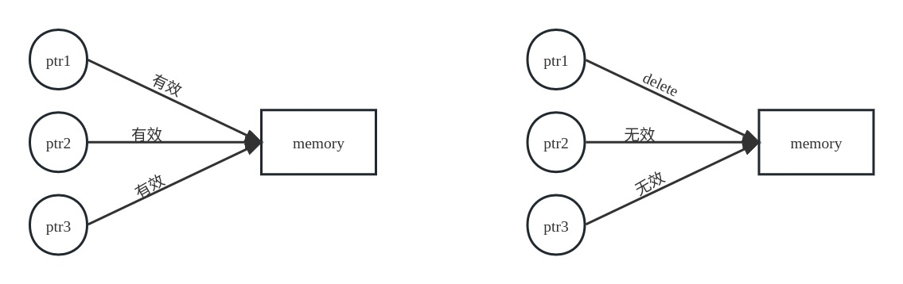
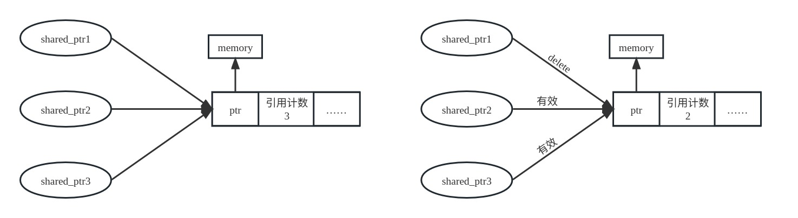
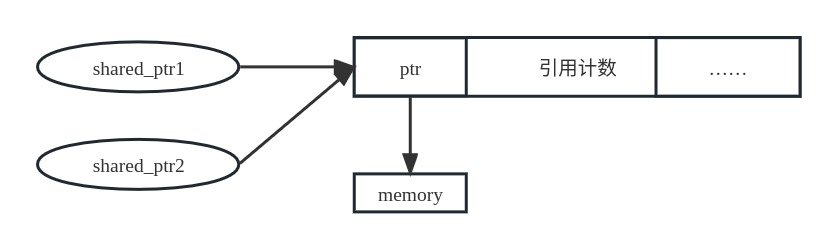
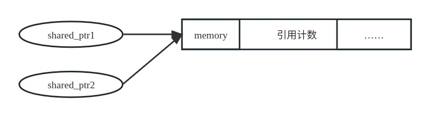

# 一. 简介

首先，`shared_ptr`类型是一个类模板，需要提供一个参数——指针可以指向的类型：

```c++
shared_ptr<string> p1;		// 可以指向 string
```

**默认初始化**的智能指针中保存着一个空指针。

我们可以简单了解一下智能指针智能的原理，我们首先分析一般指针：

如果有多个指针指向同一个动态分配的内存，如果我们使用其中某个指针对该内存进行了释放，那么使用另外两个指针将变得很危险：



而使用`shared_ptr`则大概如下：




# 二. 操作

| 操作                                               | 描述                                                         |
| -------------------------------------------------- | ------------------------------------------------------------ |
| `shared_ptr<T> sp`                                 | 空智能指针，可以指向类型为`T`的对象                          |
| `shared_ptr<T> p(p2)`                              | `p`是`shared_ptr p2`的拷贝；<br />此操作会递增`p2`中的计数器。`p2`中的指针必须能转换为`T*` |
| `shared_ptr<T> p(q)`                               | `p`管理内置指针`q`所指向的对象，<br />`q`为`new`分配的内存，且能够转换为`T*`类型 |
| `shared_ptr<T> p(u)`                               | `p`从`unique_ptr u`那里接管了对象的所有权；将`u`置为空       |
| `shared_ptr<T> p(q, d)`                            | `p`接管了内置指针`q`所指向的对象的所有权。`q`必须能够转换为`T*`类型。<br />`p`将使用可调用对象`d`来代替`delete` |
| `shared_ptr<T> p(p2, d)`                           | `p`是`shared_ptr p2`的拷贝。<br />`p`将用可调用对象`d`来代替`delete` |
| `p`                                                | 将`p`用做一个条件判断，若`p`指向一个对象，则为`true`         |
| `*p`                                               | 解引用`p`，获得它指向的对象                                  |
| `p->mem`                                           | 等价于`(*p).mem`                                             |
| `p.get()`                                          | 返回`p`中保存的指针。<br />要小心使用，若智能指针释放了其对象，返回的指针所指向的对象也就消失了。 |
| `swap(p, q)`<br />`p.swap(q)`                      | 交换`p`和`q`中的指针                                         |
| `make_shared<T>(args)`                             | 返回一个`shared_ptr`，指向一个动态分配的类型为`T`的对象。<br />使用`args`初始化此对象 |
| `p = q`                                            | `p`和`q`都是`shared_ptr`，所保存的指针必须能相互转换。<br />此操作会递减`p`的引用计数，递增`q`的引用计数；<br />若`p`的引用计数变为 0，则将其管理的原内存释放 |
| `p.unique()`                                       | 若`p.use_count()`为 1，返回`true`；否则返回`false`           |
| `p.use_count()`                                    | 返回与`p`共享对象的智能指针数量；可能很慢，主要用于调试      |
| `p.reset()`<br />`p.reset(q)`<br />`p.reset(q, d)` | 若`p`是唯一指向其对象的`shared_ptr`，`reset`会释放此对象。<br />若传递了可选的参数内置指针`q`，会令`p`指向`q`，否则会将`p`置为空。<br />若还传递了参数`d`，将会调用`d`而不是`delete`来释放`q` |

## 1. 构造`shared_ptr`

我们可以使用一个一般指针初始化一个`shared_ptr`，也可以用另一个`shared_ptr`初始化一个`shared_ptr`。需要注意的是用一个一般指针初始化一个`shared_ptr`。

由于`shared_ptr`的原理是指向一个控制块来管理内存，在一个一般指针传递给构造函数后，构造函数首先将会创建一个控制块，然后用控制块指向需要管理的内存，并将创建的`shared_ptr`对象指向该控制块，并且将该控制块的引用计数递增。

后续如果将该`shared_ptr`对象拷贝给其他对象或使用拷贝初始化时，所有的`shared_ptr`对象将指向同一个控制块，所以也将指向同一个被管理的内存。

而由于`shared_ptr`结构的特性，我们不能将同一个一般指针拿来构造多个`shared_ptr`对象，因为这将创建多个控制块，在后续的使用中将产生错误。

同时如果将一个一般指针传递给了构造函数创建了一个`shared_ptr`对象，则说明后续将通过智能指针管理动态内存，在这之后，我们最好不要再使用之前的一般指针来管理这个动态内存，特别是释放内存空间，因为这将破坏`shared_ptr`对象的状态。


## 2. make_shared 函数

最安全的分配和使用动态内存的方法是调用一个名为`make_shared`的标准库函数。此函数在动态内存中分配一个对象并初始化它，返回指向此对象的`shared_ptr`。与只能指针一样，`make_shared`也定义在头文件`memory`中。

使用该函数的方式如下所示：

```c++
shared_ptr<int> p3 = make_shared<int>(42);
```

`make_shared`首先根据模板参数`int`分配一个`int`大小的动态内存，然后用参数 42 初始化该内存的值，最后将返回的智能指针赋值给相同类型的智能指针即可。

一般的`shared_ptr`构造函数和`make_shared`函数有区别，通常来说，`make_shared`函数的效率更高，这是因为：

- 一般的`shared_ptr`构造函数通常是将控制块内存和对象分别管理：

  

- 而通过`make_shared`函数得到的`shared_ptr`对象如下：

  


## 3. 拷贝和赋值

当进行拷贝或赋值操作时，每个`shared_ptr`都会记录有多少个其他`shared_ptr`指向相同的对象：

```c++
auto p = make_shared<int>(42);		// p 指向的对象只有 p 一个引用者
auto q(p);				// p 和 q 指向相同对象，此对象有两个引用者
```

我们可以认为每个`shared_ptr`都有一个关联的计数器，通常称其为**引用计数**（reference count）。无论何时我们拷贝一个`shared_ptr`，计数器都会递增。例如，当用一个`shared_ptr`初始化另一个`shared_ptr`，或将它作为参数传递给一个函数以及作为函数的返回值时，它所关联的计数器就会递增。当我们给`shared_ptr`赋予一个新值或是`shared_ptr`被销毁（例如一个局部的`shared_ptr`离开作用域）时，计数器就会递减。

一旦一个`shared_ptr`的计数器变为 0，它就会自动释放自己所管理的对象：

```c++
auto r = make_shared<int>(42);
r = q;
```

第一条语句执行完后，`r`指向的`int`只有一个引用者；而第二条语句首先给`r`赋值，令它指向另一个地址，这将递增`q`指向的对象的引用计数并递减`r`原来指向的对象的引用计数，其结果是`r`原来指向的对象已没有引用者，会自动释放。


## 4. 析构方式

类通过一个析构函数在类对象需要被销毁的时候进行析构。

在析构之前，我们首先要了解`shared_ptr`管理内存的方式，`shared_ptr`实际上指向一个控制块（这个控制块）包含`shared_ptr`应该指向的实际的对象或指向对象的指针，以及引用计数等内容。

每增加一个`shared_ptr`对象指向该控制块，控制块的引用计数就会递增。

而每销毁一个指向该控制块的`shared_ptr`对象时就会调用`shared_ptr`的析构函数，它的析构函数的行为是递减其指向的控制块中的引用计数，如果递减之后这个引用计数值不为 0，那么后续没有其他行为；如果递减之后引用计数值为 0，那么在递减之后析构函数还会释放这块内存（如果底层的对象是一个动态分配的内存指针，那么先释放该内存）。

需要注意的是，如果我们不再需要某一块内存，那我们应该保证每一个`shared_ptr`在无用之后就不再保留。如果忘记了销毁程序不再需要的`shared_ptr`，程序虽然会正确执行，但是会浪费内存。`shared_ptr`在无用之后仍然保留的一种可能情况是，将`shared_ptr`存放在一个容器中，随后重排了容器，从而不再需要某些元素。在这种情况下，应该确保用`erase`删除那些不再需要的`shared_ptr`元素。


## 5. 临时对象的构造与析构

和我们所知道的一样，创建`shared_ptr`时会创建一个控制块，然后如果增加一个`shared_ptr`对象指向该控制块，引用计数就会递增，当引用计数不为 0 时这个对象就不会被释放。

容易产生疑惑的地方是`shared_ptr`的某些操作会产生临时量，如`make_shared`函数将会返回一个`shared_ptr`对象、函数返回值等。你是否有考虑过，如果没有一个其他`shared_ptr`对象来接受这个返回值，那很显然，这个`make_shared`所返回的对象将不再能以任何方式访问，那该函数所创建的那个对象是否会被正确的释放呢？

实际上理解这一点的关键就在于`make_shared`所返回的对象是一个临时对象，因为函数的返回值在它被使用的那条语句之后就被销毁了：

- 首先`make_shared`构造一个`shared_ptr`，它指向一个新构造的控制块，然后将该控制块的引用计数设置为 1
- 然后在返回语句中将前面构造的`shared_ptr`赋值给返回值，此时引用计数为 2
- 在函数返回之后，函数中构造的`shared_ptr`作为局部对象被销毁，引用计数减为 1
- 此时如果有新的`shared_ptr`对象接受返回值，则引用计数增为 2，否则仍然为 1
- 在使用函数调用的语句结束之后，返回值被销毁，引用计数减 1。此时如果前面为`make_shared`的返回值提供了接受对象，那么引用计数为 1，不用被销毁；而如果前面没有提供接受返回值的对象，那么引用计数减为 0，动态内存被释放


## 6. reset 操作

我们可以通过`reset`操作让`shared_ptr`指向另一个动态分配的内存或一个带有可替代`delete`操作的可调用对象的非动态分配的内存。

`reset`有三种重载：

- 第一个重载不带任何参数，`reset`将使调用该成员的`shared_ptr`指向空指针，同时，指向对象的控制块的引用计数减 1，若结果为 0，则该对象将被销毁。
- 第二个重载需要一个普通指针作为参数，这个普通指针指向的对象应该是一个`new`分配的动态内存对象。另外，`reset`在执行第一个重载函数的操作的基础上，将新创建一个控制块，用来指向这个普通指针指向的对象。
- 第三个重载同样需要一个普通指针作为参数，并且额外需要一个可调用对象作为参数。其执行的操作与第二个重载函数的操作几乎相同，唯一的区别是这个普通指针可以不是动态内存对象，并且用第二个参数替代`delete`操作。


# 三. 结合使用`shared_ptr`和`new`

## 1. 构造

我们可以用`new`返回的指针来初始化智能指针：

```c++
shared_ptr<int> p(new int(42));
```

接受指针参数的智能指针构造函数是`explicit`的，因此，我们不能将一个内置指针隐式转换为一个智能指针，必须使用直接初始化形式来初始化一个智能指针：

```c++
shared_ptr<int> p1 = new int(1024);		// 错误：必须使用直接初始化形式
shared_ptr<int> p2(new int(1024));		// 正确
```

出于相同的原因，一个返回`shared_ptr`的函数不能在其返回语句中隐式转换一个普通指针：

```c++
shared_ptr<int> clone(int p)
{
    return new int(p);		// 错误：隐式转换为 shared_ptr<int>
}
```

```c++
shared_ptr<int> clone(int p)
{
    return shared_ptr<int>(new int(p));		// 正确，显式地用 int* 创建 shared_ptr<int>
}
```

默认情况下，一个用来初始化智能指针的普通指针**必须指向动态内存**，因为智能指针默认使用`delete`释放它所关联的对象。我们可以将智能指针绑定到一个指向其他类型的资源的指针上，但是为了这样做，必须提供自己的操作来代替`delete`。


## 2. 注意事项

结合使用`shared_ptr`和`new`表达式需要注意的一点是：当将一个`shared_ptr`绑定到一个普通指针时，我们就将内存的管理责任交给了这个`shared_ptr`。一旦这样做了，我们就不应该再使用内置指针来访问（访问一个`shared_ptr`指向的内存可以使用`get`成员函数）和管理`shared_ptr`所指向的内存了。

这个注意事项主要表现在以下几点：

- **不要混合使用普通指针和智能指针**：

  在一个需要`shared_ptr`参数的地方，我们不能使用普通指针作为实参（因为其接受普通实参的构造函数是`explicit`的）。

  在这种情况下，最好的办法是**在调用之前前创建一个用普通指针初始化的 shared_ptr 对象**，如：

  ```c++
  void process(shared_ptr<int> ptr)
  {
      // 使用 ptr
  } // ptr 离开作用域，被销毁
  
  shared_ptr<int> p(new int(42));			// 引用计数为 1
  process(p);					// 函数内引用计数为 2，返回后引用计数回到 1
  int i = *p;					// 合法访问
  ```

  也可以传递给函数一个**临时的 shared_ptr 对象**，但该方法**很可能会导致错误**：

  ```c++
  int *x(new int(1024));			// 动态内存的普通指针
  process(shared_ptr<int>(x));		// 合法的，但内存会被释放
  int j = *x				// 非法访问
  ```

  如前所述，实参作为一个临时量，在传递给形参之前，引用计数为 1；

  传递给形参之后为 2，紧接着该临时量被销毁，引用计数回到 1；

  最后在离开作用域时，形参变量被销毁，引用计数变为 0，动态内存被释放。

- **不要使用同一个普通指针初始化另一个智能指针或为智能指针赋值**：

  当我们使用一个普通指针初始化一个智能指针时，将总是会构造一个新的控制块；而当我们使用一个智能指针初始化另一个智能指针时，则只是将旧的控制块的引用计数递增。

  这个特性将导致一个问题：如果我们用同一个普通指针初始化多个不同的智能指针，将会导致每个智能指针都构造一个新的控制块，而这些控制块却指向同一个对象。

  如果我们销毁了某一个智能指针，那么它所指的同时也是这些智能指针共同指向的对象内存将会被释放，此时使用另外的智能指针将会导致和使用普通指针时一样的错误，这违背了智能指针想要达到的效果。

  特别的是，`shared_ptr`的`get`成员函数会返回一个指向动态内存的普通指针对象。使用它就和使用普通指针一样，我们不能用它去初始化另一个智能指针，而只能用它来对动态内存进行访问操作，而不能用它管理动态内存（如`delete`指针或初始化另一个智能指针以及为智能指针赋值）。

  `get`用来将指针的访问权限传递给代码，只有在确定代码不会`delete`指针的情况下，才能使用`get`。
  
  由于`reset`也可能基于普通指针创建新的控制块，所以以上注意点对`reset`也需要注意。
