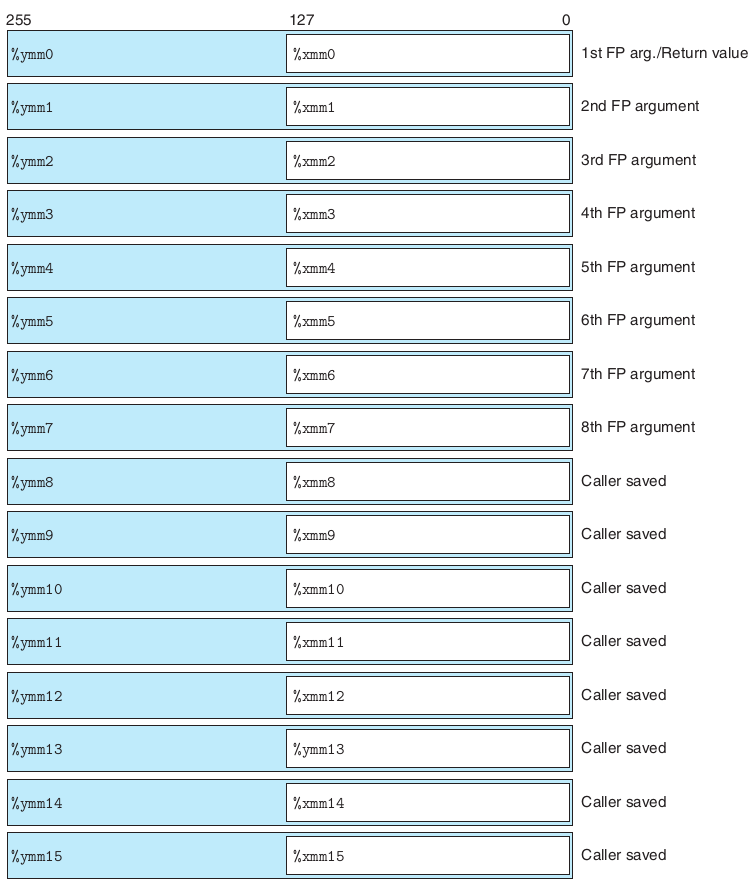

# 一. 简介

一个处理器为它的体系引入浮点体系结构具体包括以下几个方面：

- 如何存储和访问浮点数值。通常是通过某种寄存器方式来完成。
- 对浮点数据操作的指令。
- 向函数传递浮点参数和从函数返回浮点数结果的规则。
- 函数调用过程中保存寄存器的规则——例如，一些寄存器被指定为调用者保存，而其他的被指定为被调用者保存。

以下基于 AVX2 浮点体系进行介绍。

# 二. 数据

在 x86-64 中，使用以下处理器保存浮点数据：

其中每个`ymm`寄存器都是 32 字节（256 位）的，而`xmm`寄存器是`ymm`的一半，即 16 字节（128位）。

当对标量数据操作时，这些寄存器只保存浮点数，而且只使用低 32 位或 64 位。

# 三. 过程

在 x86-64 中，主要的与过程相关的浮点规则如下：

- XMM 寄存器`%xmm0`～`%xmm7`最多可以传递 8 个浮点参数。按照参数列出的顺序使用这些寄存器。可以通过栈传递额外的浮点参数。
- 函数使用寄存器`%xmm0`来返回浮点值
- 所有的 XMM 寄存器都是调用者保存的。被调用者可以不用保存就覆盖这些寄存器中任意一个。