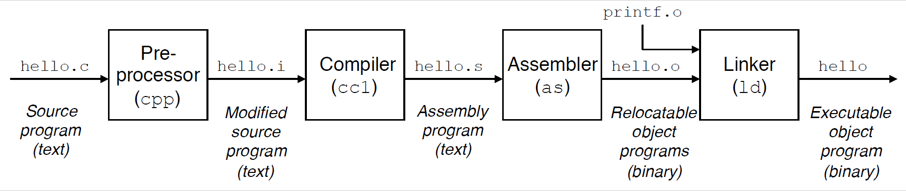
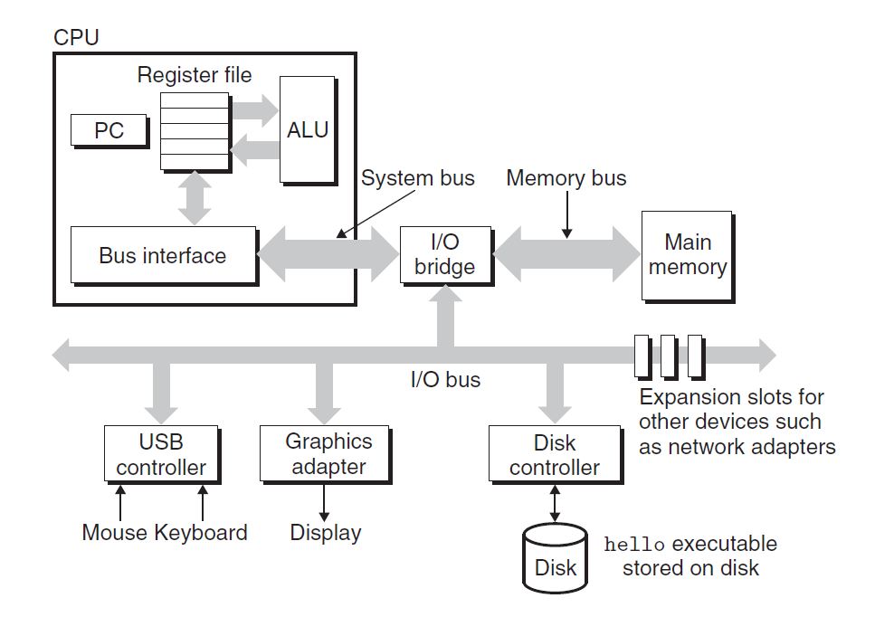
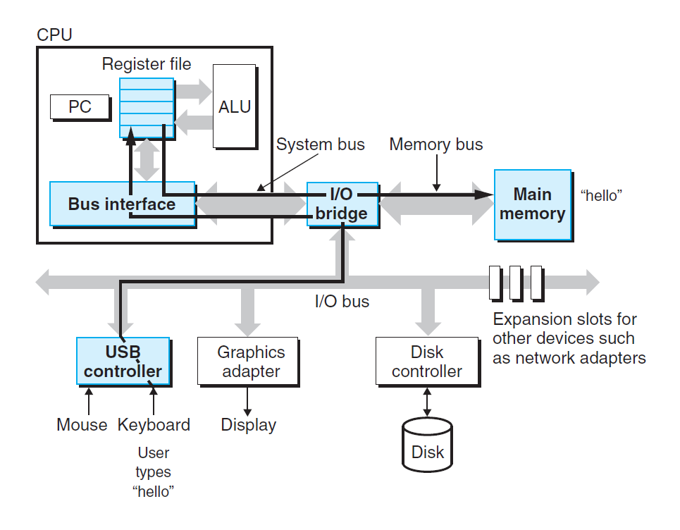
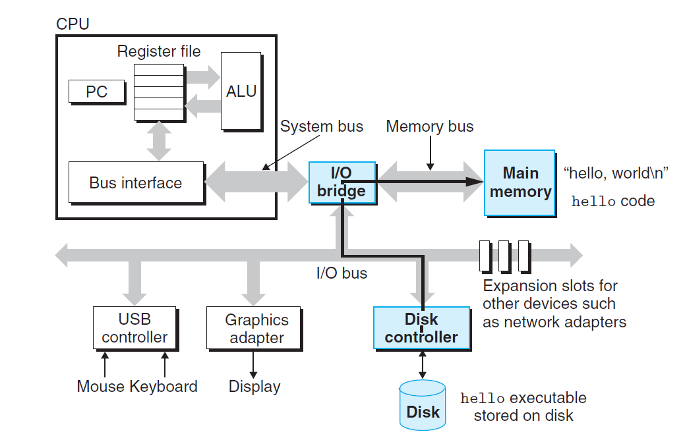
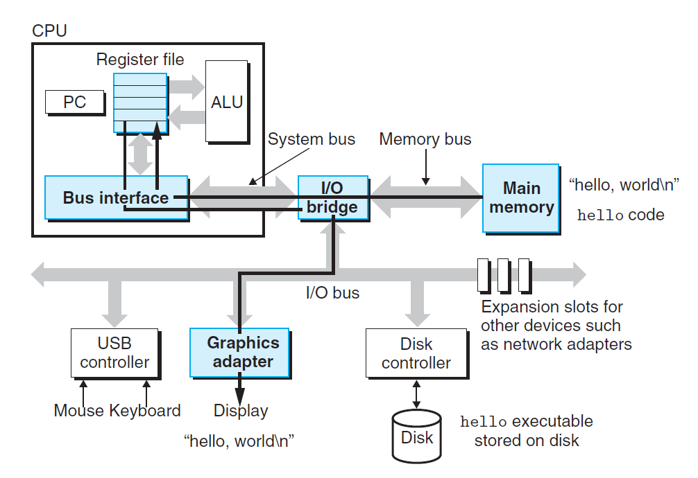
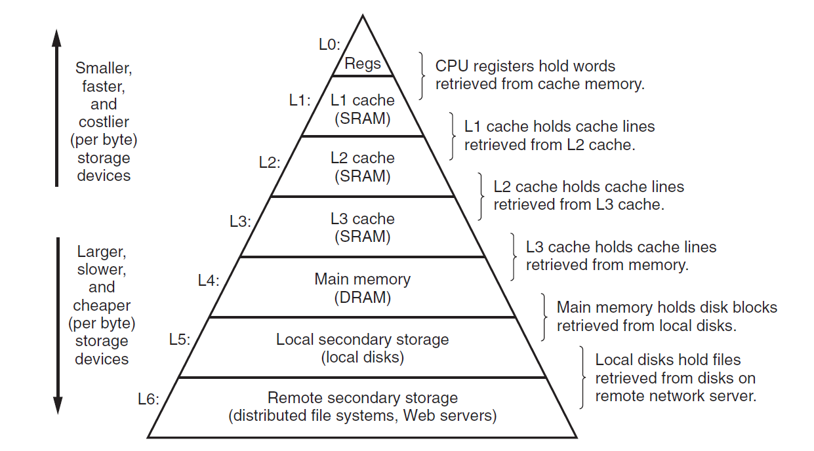
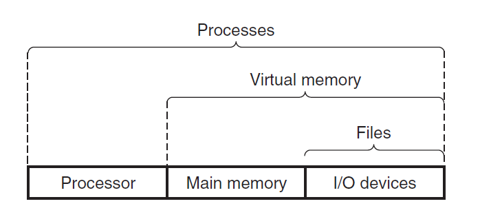
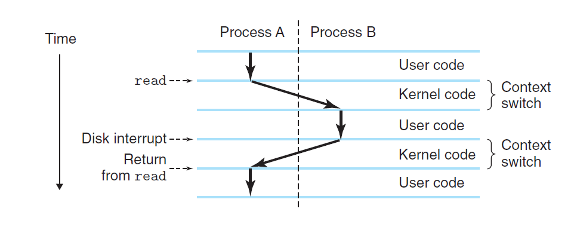
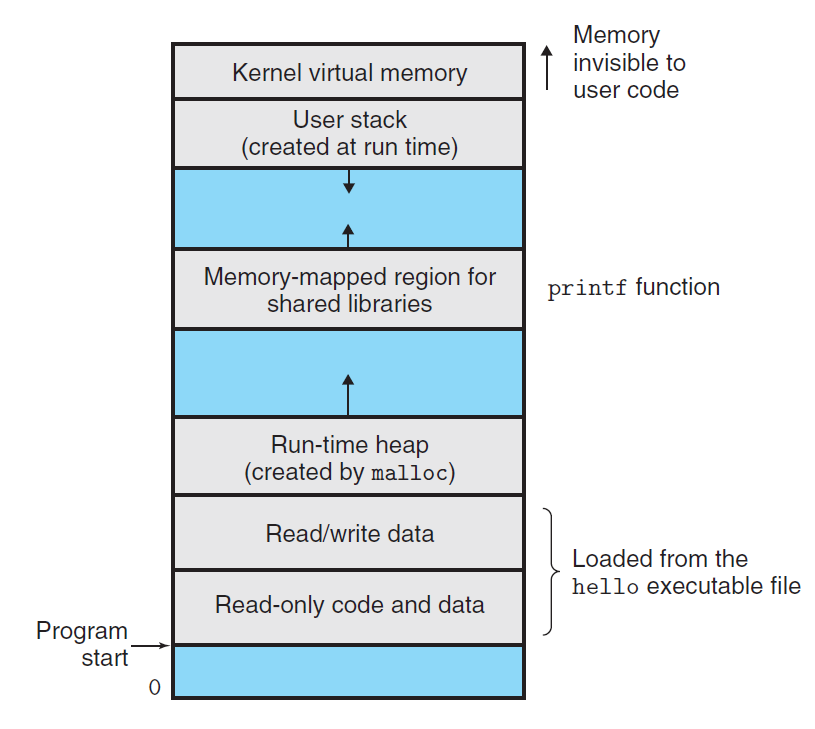
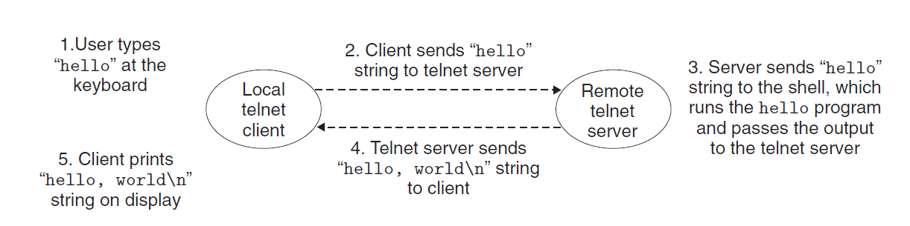

# 一. 程序编译过程

如果是一个C程序，那么一个程序从程序员编写的源文件到最后机器可执行的程序的过程大致如下：



1. **预处理阶段**：首先通过预处理器（cpp）修改源文件中以字符`#`开头的命令，它把`#include`所包含的文件的内容直接插入程序文本中，将所有`#define`定义的名字替换为该定义的值等，最后得到一个修改了之后的C程序，通常以`.i`作为文件扩展名
2. **编译阶段**：编译器（ccl）将文本文件`*.i`翻译成文本文件`*.s`，这是一个汇编语言程序，它根据机器的指令集不同而有所不同
3. **汇编阶段**：汇编器（as）将上一阶段得到的`*.s`文件翻译成机器语言指令，并把这些指令打包成一种叫做**可重定位目标程序**的格式，通常以`*.o`作为扩展名，由于某些原因，可能一个源文件所产生的`*.o`文件无法运行，比如一个源文件中所有函数的定义都定义在其他文件中时，所以一个`*.o`文件或许无法满足能够运行的条件。
4. **链接阶段**：链接器（ld）将一个程序需要的所有源文件的`*.o`文件链接到一起，最后才得到计算机能够执行的程序，也就是**可执行目标文件**


# 二. 计算机硬件结构

## 1. 组成

一个典型的计算机硬件结构如下图所示：



- **总线**（bus）：贯穿整个系统的一组电子管道，称为总线，所有数据传输几乎都会经过主线。总线通常一次传输一个定长的数据，其大小为一个**字**（word），一个字的字节数称为**字长**，一般是4个字节（32位）或8个字节（64位）

- **I/O设备**：I/O设备是系统与外部世界的联系通道，一般连接在I/O总线上。主要I/O设备有键盘、鼠标以及磁盘驱动器等等。每个I/O设备往往都通过一个控制器或适配器与I/O总线相连。控制器一般是主板上的芯片组，而适配器一般是一块插在主板插槽上的卡。

- **主存**（Main memory）：主存是一个临时存储设备，在处理器执行程序时，用来存放程序和程序处理的数据。从物理上来说，主存是由一组**动态随机存取存储器**（DRAM）芯片组成的。从逻辑上来说，存储器是一个线性的字节数组，每个字节都有其唯一的地址（数组索引），这些地址是从零开始的。

- **处理器**（CPU）：中央处理单元，简称处理器，是解释（或执行）存储在主存中指令的引擎。处理器的核心是一个大小为一个字的存储设备（或寄存器），称为**程序计数器**（PC），在任何时候，PC都指向主存中的某条机器语言指令（即含有该条指令的地址）。

  CPU在指令的要求下最常执行的操作有以下几种：

  - 加载：从主存复制一个字节到寄存器，以覆盖寄存器原来的内容
  - 存储：从寄存器复制一个字节或者一个字到主存的某个位置，以覆盖这个位置上原来的内容
  - 操作：把两个寄存器的内容复制到ALU，ALU对这两个字做算术运算，并将结果存放到一个寄存器中，以覆盖该寄存器中原来的内容
  - 跳转：从指令本身中抽取一个字，并将这个字复制到程序计数器（PC）中，以覆盖PC中原来的值

## 2. 程序运行过程

### 1）程序

首先假设程序内容如下：

```c
/* hello.c */
#include <stdio.h>

int main()
{
    printf("hello, world\n");
    return 0;
}
```

### 2）过程

首先，在操作系统中运行`shell`程序，`shell`程序等待我们输入一个命令：

- 我们首先在键盘上输入字符串：`./hello`

  

  `shell`程序将字符逐一读入寄存器，再把它存放到内存中

- 当`shell`程序识别到回车后，执行一系列指令来加载可执行的`hello`文件

  

  这些指令将`hello`目标文件中的代码和数据从磁盘复制到主存。数据包括最后会输出的字符串`"hello, world\n"`

  （这一步可以利用**直接存储器存取**（DMA）技术，数据可以不通过处理器而直接从磁盘到达主存）

- 处理器开始执行`hello`程序的`main`程序中的机器语言指令

  

  这些指令将`"hello, world\n"`字符串中的字节从主存复制到寄存器，再从寄存器文件中复制到显示设备，最终显示在屏幕上。

## 3. 存储设备的层次结构

在处理器和一个较大较慢的设备（例如主存）之间插入一个更小更快的存储设备（例如高速缓存）的想法已经成为一个普遍的概念。

一般的存储器的层次结构如下图所示：



寄存器文件在层次结构中位于最顶部，即L0。存储器层次结构的主要思想就是上一层的存储器作为低一层存储器的高速缓存。在某些具有分布式文件系统的网络系统中，本地磁盘就是存储在其他系统中磁盘上的数据的高速缓存


# 三. 操作系统

操作系统有两个基本功能：

1. 防止硬件被失控的应用程序滥用
2. 向应用程序提供简单一致的机制来控制复杂而又通常大不相同的低级硬件设备。

为了实现上述功能，操作系统首先对基础的硬件进行了抽象，如下图所示：



- 文件：I/O设备抽象为文件
- 虚拟内存：主存和I/O设备抽象为虚拟内存
- 进程：处理器、主存和I/O设备抽象为进程

## 1. 进程

**进程**是处理器、主存和I/O设备三者的抽象，可以认为一个进程就包含了这三者的状态，主要是处理器中PC和寄存器文件的当前值以及主存的内容，这种状态，也就是上下文。

对于单个CPU而言，其在任意时刻都只能执行一个进程的代码。操作系统能够给人同时进行多个进程的假象主要是因为下面的操作：当操作系统决定要把控制权从当前进程转移到某个新进程时，会进行上下文切换，即保存当前进程的上下文、恢复新进程的上下文，然后将控制权传递到新进程，新进程就会从它上次停止的地方开始。

以之前的`shell`与`hello`两个程序为例，其进程切换如下图所示：



首先在`shell`程序中等待输入，当识别到程序名和回车后，`shell`通过系统调用将控制权传递给操作系统，操作系统保存`shell`进程的上下文，创建一个新的`hello`进程及其上下文，并将控制权传给新的`hello`进程。`hello`进程终止后，操作系统恢复`shell`进程的上下文，并将控制权传回给它，`shell`进程会继续等待下一个命令行输入。

## 2. 线程

尽管通常我们认为一个进程只有单一的控制流，但是在现代系统中，一个进程实际上可以由多个称为**线程**的执行单元组成，每个线程都运行在进程的上下文中，并共享同样的代码和全局数据。

多线程之间比多进程之间一般更容易共享数据；线程一般来说都比进程更高效。

## 3. 虚拟内存

**虚拟内存**抽象的是主存和I/O设备，它为每个进程提供了一个假象，就是每个进程都在独占地使用主存。每个进程看到的内存都是一致的，称为**虚拟地址空间**，以Linux为例，其进程的虚拟地址空间如下图所示：



它主要有以下几个部分：

- 程序代码和数据：即进程程序的代码和数据所在的位置，从底部开始，其大小按照可执行目标文件的内容初始化。
- 运行时堆：主要用于程序在运行时需要动态扩展和收缩的内存，如C语言中的`malloc`和`free`函数
- 共享库：用于存放C标准库和数学库之类的共享库的代码和数据的区域，主要位于虚拟内存的中间部分
- 用户栈：用于程序的函数调用所需要的空间，和堆一样，用户栈在程序执行期间可以动态地扩展和收缩，位于虚拟地址空间的顶部
- 内核虚拟内存：位于地址空间的顶部。这部分内存为内核保留，不允许应用程序读写这个区域的内容或者直接调用内核代码定义的函数，它们必须调用内核来执行这些操作。

## 4. 文件

**文件**就是字节序列，仅此而已。每个I/O设备，包括磁盘、键盘、显示器，甚至网络，都可以看成是文件。

系统中的所有输入输出都是通过使用一小组称为Unix I/O的系统函数调用读写文件来实现的。

文件这个概念向应用程序提供了一个统一的视图来看待系统中可能含有的各式各样的I/O设备。


# 四. 网络通信

网络可以视为一个I/O设备，通过网络，我们可以将许多系统连接在一起。

假设使用网络登录到远程主机并运行`shell`后，通过网络传输数据的过程如下图所示：



1. 本地输入`hello`字符串并敲下回车键
2. 客户端软件将这个字符串通过网络发送到远程主机
3. 远程主机的`shell`软件运行`hello`程序，并将输出行返回
4. 远程主机通过网络将输出串发给客户端
5. 客户端将输出串显示在屏幕上


# 五. 其他

## 1. Amdahl定律

这个定律主要用于计算提升某一部分的性能能够对整体性能的提升程度。

其公式如下：
$$
S={1\over {(1-\alpha)+{\alpha \over k}}}
$$

- $\alpha$：该部分对于整体所占的比重
- $k$：该部分所提升的程度，其值为提升后的性能与提升前的性能的比值，也就是提升后相比于提升前的倍数
- $S$：整体性能相比于原来的性能提升的倍数

## 2. 并发和并行

- **并发**：指一个同时具有多个活动的系统
- **并行**：指的是用并发来使一个系统运行得更快

### 1）线程级并发

通过进程这个抽象，操作系统可以设计出同时有多个程序执行的系统，这就导致了并发。但是传统意义上，这种并发执行值时模拟出来的，是通过使一台计算机在它正在执行的进程间快速切换来实现的。

该并发类型通过一个处理器即可完成，只有一个处理器的配置称为**单处理器系统**。

随着多核处理器的出现，超线程也随之诞生，具有多个处理器的配置称为**多处理器系统**。

### 2）指令级并行

现代处理器可以同时执行多条指令的属性称为**指令级并行**。

早期的处理器，需要多个时钟周期来执行一条指令。而现在的处理器可以保持每个时钟周期执行多条指令。

如果处理器可以达到比一个周期一条指令更快的执行速率，就称之为**超标量**处理器

### 3）单指令、多数据并行

在最低层次上，许多现代处理器拥有特殊的硬件，允许一条指令产生多个可以并行执行的操作，这种方式称为**单指令、多数据**，即SIMD并行。