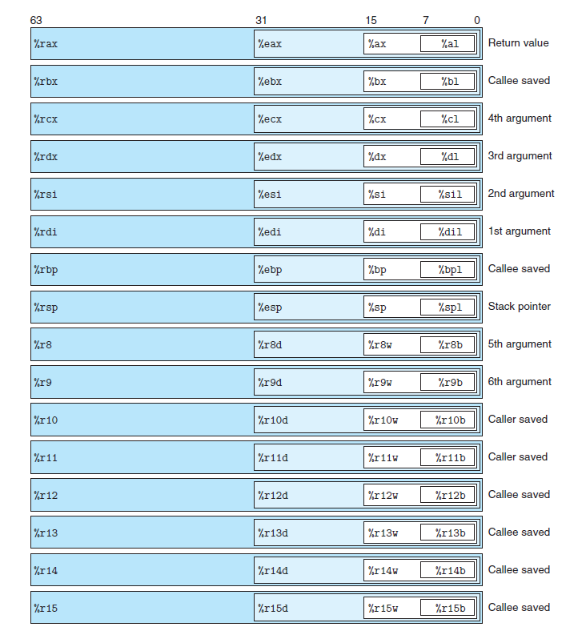

# 一. 简介

在使用汇编语言对数据进行访问之前，我们首先需要了解一些东西。

一个 x86-64 的中央处理单元包含一组 16 个存储 64 位值的**通用目的寄存器**。这些寄存器用来存储整数数据和指针，每一个寄存器都有自己独特的名字，它们的名字如下图所示：



对于该图，有几点需要说明：

- 每一个寄存器后面的语句是说明了每个寄存器的用途
- 每一个寄存器内部还有一些小的采用其他命名方式的寄存器，这是曾经的非 64 位系统使用的寄存器名字，现在依旧可以用。对于指令而言，每一个指令的字节、字、双字以及四字模式就分别对应了这些位置。
- 对于寄存器`%rsp`来说，这是用作栈指针的寄存器，用来指明运行时栈的结束位置。有些指令会明确地读写这个寄存器。对于其他 15 个寄存器，其用法比较灵活，少量指令会使用某些特定的寄存器。


# 二. 操作数

大多数指令都有一个或多个**操作数**，这些操作数指示出执行一个操作中需要使用的源数据值，以及放置结果的目的位置。

对于 x86-64 来说，它支持多种操作数格式，如常数形式或从内存中读取的方式，结果可以存放在寄存器或内存中。按照这些区别，各种不同的操作数的可能性被分为三种类型：

- **立即数**：用来表示常数值，其书写方式需加上`$`符号，比如`$-577`或`$0x1F`。不同的指令允许的立即数值返回不同，汇编器会自动选择最紧凑的方式进行数值编码
- **寄存器**：它表示某个寄存器的内容，16 个寄存器的低位 1 字节、2 字节、4 字节或 8 字节中的一个作为操作数。可以用 $r_a$ 来表示任意存储器，用引用 $R[r_a]$ 来表示它的值
- **内存**：它会根据计算出来的地址（通常称为有效地址）访问某个内存位置。内存有很多具体的表示方法，现在先像这样抽象：内存地址都用 $Addr$ 表示，那么 $M_b[Addr]$ 表示访问内存地址为 $Addr$ 处 $b$ 个字节值的引用。另外，用于表示或计算内存地址的寄存器必须是 64 位的。

操作数格式如下表所示：

| 类型   | 格式             | 操作数值                      | 名称                |
| ------ | ---------------- | ----------------------------- | ------------------- |
| 立即数 | $\$Imm$          | $Imm$                         | 立即数寻址          |
| 寄存器 | $r_a$            | $R[r_a]$                      | 寄存器寻址          |
| 存储器 | $Imm$            | $M[Imm]$                      | 绝对寻址            |
| 存储器 | $(r_a)$          | $M[R[r_a]]$                   | 间接寻址            |
| 存储器 | $Imm(r_b)$       | $M[Imm+R[r_b]]$               | （基址+偏移量）寻址 |
| 存储器 | $(r_b, r_i)$     | $M[R[r_b]+R[r_i]]$            | 变址寻址            |
| 存储器 | $Imm(r_b,r_i)$   | $M[Imm+R[r_b]+R[r_i]]$        | 变址寻址            |
| 存储器 | $(,r_i,s)$       | $M[R[r_i]\cdot s]$            | 比例变址寻址        |
| 存储器 | $Imm(,r_i,s)$    | $M[Imm+R[r_i]\cdot s]$        | 比例变址寻址        |
| 存储器 | $(r_b,r_i,s)$    | $M[R[r_b]+R[r_i]\cdot s]$     | 比例变址寻址        |
| 存储器 | $Imm(r_b,r_i,s)$ | $M[Imm+R[r_b]+R[r_i]\cdot s]$ | 比例变址寻址        |


# 三. 传送数据

最频繁使用的是将数据从一个位置复制到另一个位置的指令。由于操作数表示的通用性，使得一条简单的数据传送指令能够完成在许多机器中要好几条不同指令才能完成的功能。

## 1. MOV类

主要将第一个操作数的值复制到第二个操作数的位置，其具体的语法和指令如下表：

| 指令                                                         | 效果                | 描述                                                         |
| :----------------------------------------------------------- | :------------------ | ------------------------------------------------------------ |
| $MOV \ S\ , \ D$                                             | $D\longleftarrow S$ | 传送                                                         |
| `movb`   $I\ ,\ R$<br />`movw`   $I\ ,\ R$<br />`movl`   $I\ ,\ R$<br />`movq`   $I\ ,\ R$<br />`movabsq`   $I\ ,\ R$ | $R\longleftarrow I$ | 传送字节<br />传送字<br />传送双字<br />传送四字<br />传送绝对的四字 |

> - 对于这几个命令，它们都执行相同的操作，主要区别在于它们操作的数据大小的不同：分别是 1、2、4 和 8 字节
> - x86-64 中有一个限制，**传送指令的两个操作数不能都指向内存位置**，将一个值从一个内存位置复制到另一个内存位置需要两条指令——先将源值加载到寄存器中，然后将该寄存器值写入目的位置
> - 这些指令的寄存器可以是 16 个寄存器有标号部分中的任意一个，**寄存器部分的大小必须与指令最后一个字符（‘b’，‘w’，‘l’或‘q’）指定的大小匹配。**
> - x86-64 中还有一个规定：**任何为寄存器生成 32 位值的指令都会把该寄存器的高位部分置为 0**
> - `movq`指令只能以表示为 32 位补码数字的立即数作为源操作数，然后把这个值符号扩展得到 64 为的值，放到目的位置。`movabsq` **指令能够以任意 64 位立即数值作为源操作数**，并且只能以寄存器作为目的。

**例**：

```assembly
movl $0x4050, %eax
movw %bp, %sp
movb (%rdi, %rcx), %al
movb $-17, (%rsp)
movq %rax, -12(%rbp)
```


## 2. MOVZ类

同样是移动指令，但是这个指令会把目的中剩余的字节填充为 0，其具体的语法和指令如下表所示：

| 指令                                                         | 效果                          | 描述                                                         |
| ------------------------------------------------------------ | ----------------------------- | ------------------------------------------------------------ |
| $MOVZ \ \ S\ ,\ R$                                           | $R\longleftarrow$ 零扩展$(S)$ | 以零扩展进行传送                                             |
| `movzbw`<br />`movzbl`<br />`movzwl`<br />`movzbq`<br />`movzwq` |                               | 将做了零扩展的字节传送到字<br />将做了零扩展的字节传送到双字<br />将做了零扩展的字传送到双字<br />将做了零扩展的字节传送到四字<br />将做了零扩展的字传送到四字 |

> - 由于 $MOV$ 指令中从双字到四字本来就会进行零扩展，所以在上面的指令中不包含这一条
> - 每条指令的最后两个字符都是大小指示符：第一个字符指定源的大小，第二个指明目的的大小
> - 指令只考虑目的的字节数大于源的情况


## 3. MOVS类

还是传送数据的指令，在将较小的源值复制到较大的目的时使用，和 MOVZ 类相同，但是使用符号扩展，即使用源操作数的最高位进行复制，然后填充，其具体的语法和指令如下表所示：

| 指令                                                         | 效果                                                         | 描述                                                         |
| ------------------------------------------------------------ | ------------------------------------------------------------ | ------------------------------------------------------------ |
| $MOVS\ \ \ S\ ,\ R$                                          | $R\longleftarrow$ 符号扩展$(S)$                              | 传送符号扩展的字节                                           |
| `movsbw`<br />`movsbl`<br />`movswl`<br />`movsbq`<br />`movswq`<br />`movslq`<br />`cltq` | <br /><br /><br /><br /><br /><br />`%rax`$\longleftarrow$ 符号扩展(`%eax`) | 将做了符号扩展的字节传送到字<br />将做了符号扩展的字节传送到双字<br />将做了符号扩展的字传送到双字<br />将做了符号扩展的字节传送到四字<br />将做了符号扩展的字传送到四字<br />将做了符号扩展的双字传送到四字<br />把`%eax`符号扩展到`%rax` |

> - `cltq`没有操作数：它总是以寄存器`%eax`作为源，`%rax`作为符号扩展结果的目的。它的效果与指令`movslq %eax, %rax`完全一致，不过编码更紧凑


# 四. 压入和弹出栈数据

另外一个常用的访问信息的操作是栈操作，主要是会用到`%rsp`寄存器。栈操作包括两个指令：`push`和`pop`。其具体的语法和指令如下表所示：

| 指令      | 效果                                                         | 描述         |
| --------- | ------------------------------------------------------------ | ------------ |
| `pushq S` | $R[$`%rsp`$]\longleftarrow R[$`%rsp`$]-8$；<br />$M[R[$`%rsp`$]]\longleftarrow S$ | 将四字压入栈 |
| `popq D`  | $D\longleftarrow M[R[$`%rsp`$]]$；<br />$R[$`%rsp`$]\longleftarrow R[$`%rsp`$]+8$ | 将四字弹出栈 |

> - 需要明确的是，寄存器`%rsp`应该看作一个数组的地址（指针），而不是一个链表的指针。
> - 栈遵循“后进先出”的原则
> - 这个栈向下增长，也就是说栈底的地址最高，栈顶的地址最低
> - `%rsp`寄存器中保存着当前栈顶元素在内存中的位置
> - 可以看到，每个指令都包含两个操作，对于`pushq`来说，首先移动栈顶指针（即改变`%rsp`寄存器的值，一般是 -8，即向栈顶方向移动一个元素），然后将操作数保存到该位置；对于`popq`来说，首先将当前栈顶元素的值赋给指令的操作数（应该是一个寄存器），然后移动栈顶指针（向栈底方向移动一个元素）

