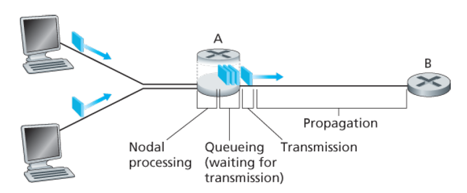
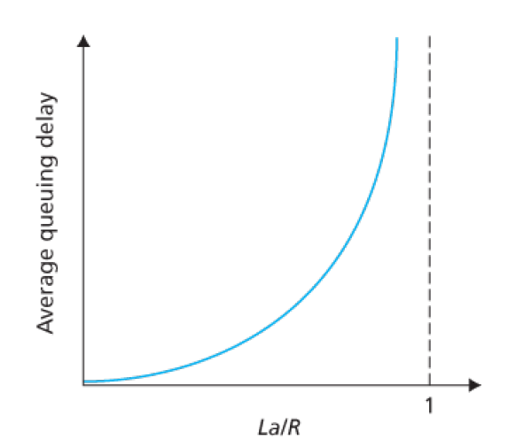

当使用分组交换网络时，会出现时延和丢包等问题，在下面对其进行讨论。

# 一. 时延

分组从一个节点到另一个节点的传输过程一定会有一个时间消耗，这个时间消耗称为**节点总时延**（total nodal delay）。

如图所示，这个节点总时延由以下几部分组成：

## 1. 处理时延

也称作**节点处理时延**（nodal processing delay）。

检查分组首部和决定将该分组导向何处所需要的时间是处理时延的一部分。处理时延也能够包括其他因素，如检查比特级别的差错所需要的时间，该差错出现在从上游节点向路由器A传输这些分组比特的过程中。高速路由器的处理时延通常是微妙或更低的数量级。在这种节点处理之后，路由器将该分组引向通往路由器B链路之前的队列。

## 2. 排队时延

**排队时延**（queuing delay）。

在队列中，当分组在链路上等待传输时，它经受排队时延。一个特定分组的排队时延长度将取决于先期到达的正在排队等待向链路传输的分组数量。如果该队列是空的，并且当前没有其他分组正在传输，则该分组的排队时延为 0。另一方面，如果流量很大，并且许多其他分组也在等待传输，该排队时延将很长。实际的排队时延可以是毫秒到微秒量级。

## 3. 传输时延

**传输时延**（transmission delay）。

假定分组以先到先服务的方式传输——这在分组交换网中是常见的方式，仅当所有已经到达的分组被传输后，才能传输刚到达的分组。用 $L$ 比特表示该分组的长度，用 $R$ bps 表示从路由器 A 到路由器 B 的链路传输速率。例如，对于一条 10Mbps 的以太网链路，速率 $R=$ 10Mbps ；对于一条 100Mbps 的以太网链路，速率 $R=$ 100Mbps。传输时延是 $L/R$。这是将所由分组的比特推向链路所需要的时间。实际的传输时延通常在毫秒到微秒量级。

## 4. 传播时延

**传播时延**（propagation delay）。

一旦一个比特被推向链路，该比特需要向路由器B传播。从该链路的起点到路由器B传播所需要的时间是传播时延。该比特以该链路的传播速率传播。该传播速率取决于该链路的物理媒介（即光纤、双绞铜线等），其速率范围是 $2\times 10^8$ ~ $3\times 10^8$ m/s，这等于或略小于光速。该传播时延等于两台路由器之间的距离除以传播速率。即传播时延是 $d/s$，其中 $d$ 是路由器A和路由器B之间的距离，$s$ 是该链路的传播速率。在广域网中，传播时延为毫秒量级。

## 5. 节点总时延

如果令 $d_{proc}$、$d_{queue}$、$d_{trans}$、$d_{prop}$ 分别表示处理时延、排队时延、传输时延和传播时延，则节点的总时延由下式给定：
$$
d_{nodal}=d_{proc}+d_{queue}+d_{trans}+d_{prop}
$$
这些时延成分所起的作用可能会有很大的不同。例如，对于连接两台位于同一个大学校园的路由器的链路而言，$d_{prop}$ 可能是微不足道的（例如，几微秒）；然而，对于由同步卫星链路互联的两台路由器来说，$d_{prop}$ 是几百毫秒，能够成为 $d_{nodal}$ 中的主要成分。

# 二. 排队时延和丢包

什么时候排队时延大，什么时候又不大呢？我们进行如下讨论：

令 $a$ 表示分组到达队列的平均速率（以 分组/秒 为单位，即 pkt/s）；令 $R$ 表示传输速率，即从队列中推出比特的速率（以 bps 为单位）。假定所由分组都只有 $L$ 比特。那么比特到达队列的平均速率是 $La$ bps。假定该队列能容纳无限数量的比特。那么 $La/R$ 被称为**流量强度**（traffic intensity），即到达的比特与推出的比特的数量之比。

当 $La/R>1$ 时，说明到达的比特大于推出的比特，即比特到达队列的平均速率超过从该队列传输出去的速率。在这种情况下，该队列趋向于无限增加，并且排队时延将趋向无穷大。

当 $La/R\leqslant 1$ 时，此时，到达流量的性质影响排队时延。例如，如果分组周期性到达，即每 $L/R$ 秒到达一个分组，则每个分组将到达一个空队列中，不会有排队时延。如果分组以突发形式到达而不是周期性到达，则可能会有很大的平均排队时延。例如，如果每 $(L/R)N$ 秒同时到达 $N$ 个分组，平均到每一秒，还是一秒到达一个分组，但是在该情况下，传输的第一个分组没有排队时延，而传输的第二个分组就有 $L/R$ 秒的排队时延，传输的第 $n$ 个分组就有 $(n-1)L/R$ 秒的排队时延。

所以实际上的平均排队时延与流量强度的关系如下图所示：

随着流量强度接近于 1，平均排队时延迅速增加。该强度的少量增加将导致时延大比例增加。

更一般的情况是队列只有有限的容量，在这种情况下，随着流量强度接近 1，排队时延并不真正趋向无穷大。相反，到达的分组将发现一个满的队列。由于没有地方存储这个分组，路由器将**丢弃**（drop）该分组，即该分组将会**丢失**（lost）。

分组丢失的比例随着流量强度增加而增加。因此，一个结点的性能常常不仅根据时延来度量，而且根据丢包的概率来度量。

# 三. 端到端时延

前面讨论了在两个节点之间的时延，现在考虑从源到目的地的总时延。

假设在源主机和目的主机之间由 $N-1$ 台路由器，并且假定该网络此时是无拥塞的（因此排队时延是可以忽略不计的），每台路由器和源主机上的处理时延是 $d_{proc}$，每台路由器和源主机的输出速率是 $R$ bps，每条链路的传播时延是 $d_{prop}$ 。节点时延累加起来，就可以得到端到端时延：
$$
d_{end-end}=N(d_{proc}+d_{trans}+d_{prop})
$$
其中 $d_{trans}=L/R$，$L$ 是分组长度。

除了一般的时延，端系统中还有一些其他的重要时延。例如，希望向共享媒体（例如在WiFi或电缆调制解调器情况下）传输分组的端系统可能有意地延迟它的传输，把这作为它与其他端系统共享媒体的协议的一部分；另一个重要的时延是媒体分组化时延，这种时延出现在 IP 语音（VoIP）应用中。在 VoIP 中，发送方在向因特网传递分组之前必须首先用编码的数字化语音填充一个分组。这种填充一个分组的时间称为分组化时延，它可能较大，并能够影响用户感受到的 VoIP 呼叫的质量。

# 四. 计算机网络中的吞吐量

除了时延和丢包，计算机网络中另一个至关重要的性能测度是端到端吞吐量。

吞吐量的定义如下：

假设从主机A向主机B传输一个文件，那么：

**瞬时吞吐量**（instantaneous throughput）：任意瞬间主机B接收到该文件的速率（单位：bps）

**平均吞吐量**（average throughput）：文件大小与从开始接收文件到完成接收文件所花的时间的比值（单位：bps）
