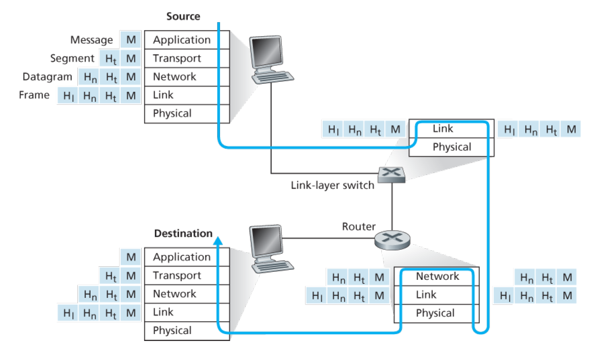

# 一. 分层的体系结构

网络通过分层的服务来对服务进行封装，每一层的更改并不会影响其他层次的内容。

将每一层的所有协议综合起来，被称为**协议栈**（protocol stack）。最通用的协议栈是因特网协议栈，它由五个层次组成。

## 1. 因特网协议栈

### 1）应用层

应用层是网络应用程序及它们的应用层协议存留的地方。因特网的应用层包括许多协议，例如 HTTP（它提供了 Web 文档的请求和传送）、SMTP（它提供了电子邮件报文的传输）和 FTP（它提供两个端系统之间的文件传送）。

创建并部署我们自己的新应用层协议是非常容易的。

应用层协议分布在多个端系统上，而一个端系统中的应用程序使用协议与另一个端系统中的应用程序交换信息分组。

这种位于应用层的信息分组称为**报文**（message）。

### 2）运输层

因特网的运输层在应用程序短点之间传送应用层报文。

在因特网中，有两种运输协议，即 TCP 和 UDP，利用其中的任一个都能运输应用层报文。TCP 向它的应用程序提供了面向连接的服务。这种服务包括了应用层报文向目的地的确保传递和流量控制（即发送方/接收方速率匹配）。TCP 也将长报文划分为短报文，并提供拥塞控制机制，因此当网络拥塞时，源抑制其传输速率。UDP 协议向它的应用程序提供无连接服务。这是一种不提供不必要服务的服务，没有可靠性，没有流量控制，也没有拥塞控制。

这种位于运输层的分组称为**报文段**（segment）。

### 3）网络层

因特网的网络层负责将称为**数据报**（datagram）的网络层分组从一台主机移动到另一台主机。在一台源主机中的因特网运输层协议（TCP或UDP）向网络层递交运输层报文段和目的地址。

因特网的网络层包括著名的网际协议 IP，该协议定义了在数据报中的各个字段以及端系统和路由器如何作用于这些字段。IP 仅有一个，所有具有网络层的因特网组件必须运行 IP。因特网的网络层也包括决定路由的路由选择协议，它根据该路由将数据报从源传输到目的地。因特网具有许多路由选择协议。

### 4）链路层

因特网的网络层通过源和目的地之间的一系列路由器路由数据报。为了将分组从一个节点（主机或路由器）移动到路径上的下一个节点，网络层必须依靠链路层的服务。特别是在每个节点，网络层将数据报下传给链路层，链路层沿着路径将数据报传递给下一个节点。在该下一个节点，链路层将数据报上传给网络层。

由链路层提供的服务取决于应用于该链路的特定链路层协议。例如，某些协议基于链路提供可靠传递，从传输节点跨越一条链路到接收节点。因为数据报从源到目的地传送通常需要经过几条链路，一个数据报可能被沿途不同链路上的不同链路层协议处理。例如，一个数据报可能被一段链路上的以太网和下一段链路上的PPP所处理。网络层将受到来自每个不同的链路层协议的不同服务。

处于链路层的分组称为**帧**（frame）。

### 5）物理层

链路层的任务是将整个帧从一个网络元素移动到邻近的网络元素，而物理层的任务是将该帧中的一个个比特从一个节点移动到下一个节点。在这层中的协议仍然是链路相关的，并且进一步与该链路的实际传输媒介相关（例如，双绞铜线、单模光纤）。例如，以太网具有许多物理层协议：一个是关于双绞铜线的，另一个是关于同轴电缆的，还有一个是关于光纤的，等等。在每种场合中，跨越这些链路移动一个比特是以不同的方式进行的。

## 2. OSI模型

因特网协议栈并非唯一的协议栈，在 20 世纪 70 年代后期，国际标准化组织（ISO）提出计算机网络围绕 7 层来组织，称为开放系统互连（OSI）模型。

OSI 模型的 7 层分别是：应用层、表示层、会话层、运输层、网络层、数据链路层和物理层。相比于因特网协议栈，增加了一个表示层和会话层。

表示层的作用是使通信的应用程序能够解释交换数据的含义。这些服务包括数据压缩和数据加密以及数据描述。

会话层提供了数据交换的定界和同步功能，包括建立检查点和恢复方案的方法。

因特网缺少了这两个层次，但其并不打算添加这两个层次，而是留给应用程序开发者处理。应用程序开发者决定一个服务是否是重要的，如果该服务重要，应用程序开发者就应该在应用程序中构建该功能。

# 二. 封装

一段数据在网络中的传输过程如下图所示：

从上图我们可以发现两个事实：

- 发送方的数据传输过程是从顶层开始加工到物理层之后发送出去；接收方都是由底层的物理层开始接收并解封数据。
- 在由顶层到底层的发送过程中，数据每走一层，都会多一部分内容；而在由底层到顶层的接收过程中，数据每走一层，都会少一部分内容。这个过程叫做封装和解封装

**封装**（encapsulation）的大致过程如下：

- 在发送主机端，一个**应用层报文**（application-layer message）被传送给运输层（此时的数据为图中的$M$）。
- 在最简单的情况下，运输层收取到报文并附上附加信息（即运输层首部信息$H_t$，此时的数据为图中的 $H_t+M$），该首部将被接收端的运输层使用。应用层报文和运输层首部信息一起构成了**运输层报文段**（transport-layer segment）。运输层报文段就是对应用层报文的一个封装。附加的信息也许包括了下列信息：允许接收端运输层向上向适当的应用程序交付报文的信息；差错检测位信息，该信息让接收方能够判断报文中的比特是否在途中已被改变。
- 运输层向网络层传递该报文段，网络层增加了如源和目的端系统地址等网络层首部信息（$H_n$，此时的数据为图中的 $H_n+H_t+M$），**网络层数据报**（network-layer datagram）就是对运输层报文段的封装。
- 网络层向链路层传递该数据报，链路层增加了其自己的链路层首部信息（$H_l$，此时的数据位图中的 $H_l+H_n+H_t+M$）并生成**链路层帧**（link-layer frame），这是对网络层数据报的封装。
- 物理层将链路层帧转化为物理信号发送出去。

可以看到，在每一层，一个分组具有两种类型的字段：首部字段和**有效载荷字段**（payload field）。有效载荷字段通常是来自上一层的分组。