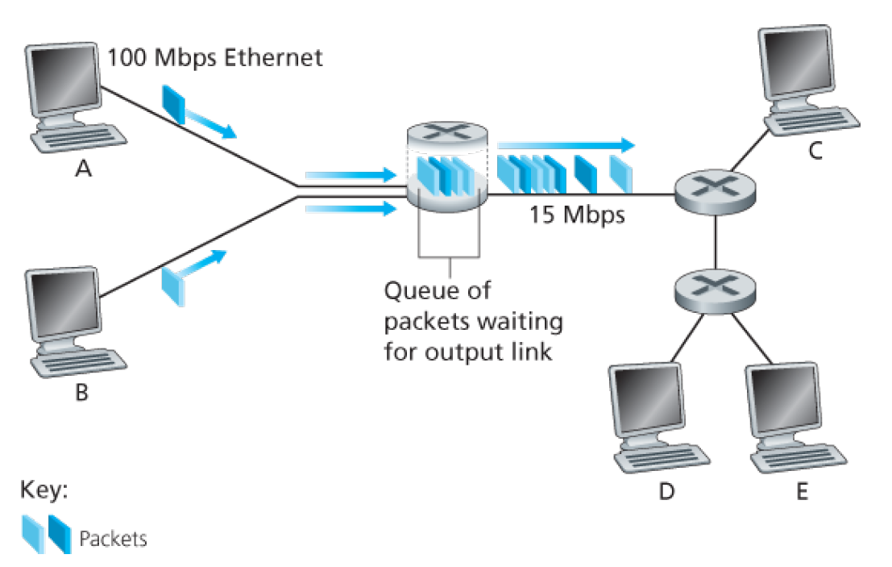
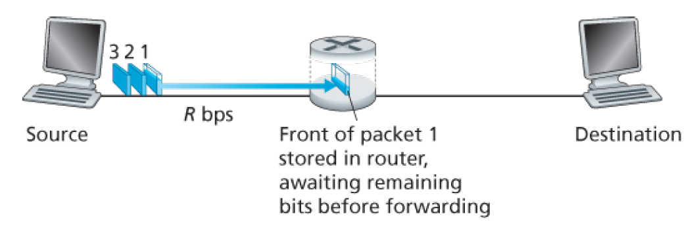
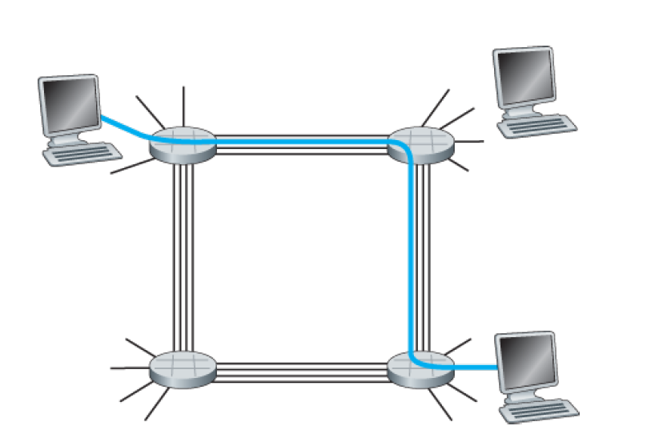
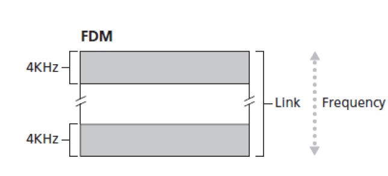
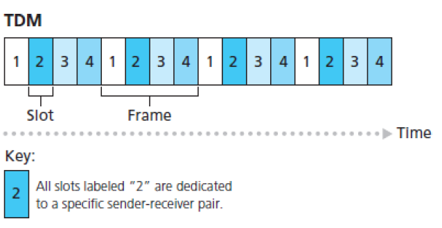

# 一. 分组交换

整个因特网除了网络边缘之外就是网络核心了，主要是由互联因特网端系统的分组交换机和链路构成的网状网络。

在各种网络应用中，端系统彼此交换**报文**（message）。报文能够包含协议设计者需要的任何东西。报文可以执行一种控制功能，也可以包含数据，例如电子邮件系统、JPEG 图像或 MP3 音频文件。为了从源端向目的端系统发送一个报文，源将长报文划分为较小的数据块，称之为**分组**。

在源和目的地之间，每个分组都通过通信链路和**分组交换机**传送。交换机主要有两类：**路由器**和**链路层交换机**。分组以等于该链路最大传输速率的速度传输通过通信链路。因此，如果某源端系统或分组交换机经过一条链路发送一个 L 比特的分组，链路的传输速率为 R 比特/秒，则传输该分组的时间为 L/R 秒。

其具体过程如下图所示：

## 1. 存储转发传输

多数分组交换机在链路的输入端使用**存储转发传输**（store-and-forward transmission）机制。

存储转发传输是指：在交换机能够开始向传输链路传输该分组的第一个比特之前，必须接收到整个分组，如下图所示：

上图是一个经过简化之后的网络，只有两个端系统和一个路由器组成，而实际的一台路由器通常有多条繁忙的链路，因为它的任务就是把一个入分组交换到一条出链路。在这个简单例子中，该路由器的任务就只是将分组从一条输入链路转移到另一条唯一的连接链路。

可以看到，路由器已经接收到了分组 1 的一部分，但是路由器并没有急着将数据转发出去，而是在等着分组 1 传输完成，所以路由器的工作是先缓存一个分组，然后再将分组转发。

从转发速率上来说，如果使用存储转发传输，那么将一个分组从一个端系统发送到另一个端系统就需要经过两段，假设发送的分组大小为 L 比特，传播速率为 R 比特/秒，然后忽略传播时延（即数据走过相当长度链路所花的时间），那么第一段从发送端系统到路由器需要经过 L/R 的时间，然后从路由器到接收端系统需要经过 L/R 的时间，总的来说就是 2L/R 的时间。

而如果不使用存储转发传输，那么将一个分组从一个端系统发送到另一个端系统就只算一段，因为路由器不会在中间进行阻挡，而时接收到一个比特就转发一个比特，此时需要的时间就是 L/R。

按照存储转发传输的机制进行计算，通过由 N 条速率均为 R 的链路组成的路径（忽略传播时延）传输一个分组，那么端到端的时延是：
$$
d_{端到端}=N{L\over R}
$$
而对于一般情况，即 P 个分组，通过 N 条速率为 R 的链路组成的路径，此时端到端的时延是：
$$
d_{端到端}=[N+(P-1)]{L\over R}
$$

## 2. 排队时延和分组丢失

每台分组交换机有多条链路与之相连。对于每条相连的链路，该分组交换机具有一个**输出缓存**（output buffer，也称为**输出队列**（output queue）），它用于存储路由器准备发往那条链路的分组。

如果到达的分组需要传输到某条链路，但发现该链路正忙于传输其他分组，该到达分组必须在输出缓存中等待。因此，除了存储转发时延之外，分组还要承受输出缓存的**排队时延**（queuing delay）。这些时延时有变化的，变化的程度取决于网络的拥塞程度。

另外，由于缓存空间的大小是有限的，一个到达的分组可能发现该缓存已被其他等待传输的分组完全充满了。在此情况下，将会出现**分组丢失（丢包）**（packet loss），到达的分组或已经排队的分组之一将被丢弃。

## 3. 转发表和路由选择协议

路由器通过**转发表**（forwarding table）来查询一个发送来的分组的目的地址，并将其映射成为输出链路。

对于因特网而言，每个端系统具有一个称为 IP 地址的地址，当源主机要向目的端系统发送一个分组时，源在该分组的首部包含了目的地的 IP 地址。当某分组到达一台路由器时，路由器检查该地址，并用这个目的地址搜索其转发表，以发现适当的出链路。路由器则将分组导向该出链路。

每一个路由器只检查分组的目的地址的一部分，因为路由器的工作原理是将一个分组不断发往下一个更接近的路由器，最终到达端系统，而在离发送端系统近的路由器中只有地址前面部分的链路映射，只有越到后面，地址与链路的映射才越来越精确，最终到达接收端系统。

而对于每台路由器中的转发表，并非通过人工对每台路由器逐台进行配置，而是通过一些特殊的**路由选择协议**（routing protocol），用于自动地设置这些转发表。例如，一个路由选择协议可以决定从每台路由器到每个目的地的最短路径，并使用这些最短路径结果来配置路由器中的转发表。

# 二. 电路交换

通过网络链路和交换机移动数据有两种基本方法：**电路交换**（circuit switching）和**分组交换**（packet switching）。

在电路交换网络中，在端系统间通信会话期间，预留了端系统间沿路径通信所需要的资源（缓存，链路传输速率），在分组交换网络中，这些资源则不是预留的。这意味着分组交换网络中，会话的报文按需使用这些资源，其后果可能是不得不排队接入通信线路，但电路交换网络不需要，因为在任意两个端系统之间都有唯一一条路线将两个端系统进行连接，也就是说两个端系统之间的会话可以不需要排队直接进行。电路交换网络的图示如下：

在发送方能够发送信息之前，该网络必须在发送方和接收方之间建立一条名副其实的连接，该连接被称为一条**电路**（circuit）。当网络创建这种电路时，它也在连接期间在该网络链路上预留了恒定的传输速率（表示为每条链路传输容量的一部分）。如上图所示，用 4 条链路互联了 4 台电路交换机。这些链路中的每条都有 4 条电路，因此每条链路能够支持 4 条并行的连接。每台主机都与一台交换机直接相连。当两台主机要通信时，该网络在两台主机之间创建一条专用的**端到端连接**（end-to-end connection）。

而分组交换网络中发送一个分组的情况是：该分组被发送进网络，而不预留任何链路资源之类的东西。如果此时其他分组也需要经过该链路进行传输，而且该链路出现拥塞情况下，该分组将不得不在传输链路发送侧的缓存中等待而产生时延。

## 1. 电路交换网络中的复用

链路中的电路是通过**频分复用**（Frequency-Division Multiplexing, FDM）或**时分复用**（Time-Division Multiplexing, TDM）来实现的。

**FDM**：

对于FDM，链路的频谱由跨越链路创建的所有连接共享。特别是，在连接期间链路为每条连接专用一个频段。在电话网络中，这个频段的宽度通常为4kHz。该频段的宽度称为**带宽**（band-width）。调频无线电台也使用FDM来共享 88MHz ~ 108MHz的频谱，其中每个电台被分配一个特定的频段。

如下图所示：

该图显示出整个链路有一个频率域，然后该频率域被划分为一个个带宽为 4kHz 的频段。一般被划分出的频段个数应该等于该链路实际的电路个数。

**TDM**：

对于TDM链路，时间被划分为固定期间的帧，并且每个帧又被划分为固定数量的时隙。当网络跨越一条链路创建一条连接时，网络在每个帧中为该连接指定一个时隙。这些时隙专门由该连接单独使用，一个时隙（在每个帧内）可用于传输该连接的数据。

如下图所示：

该图显示出，对于TDM，其时域被分割为帧，在每个帧中具有4个时隙，在循环的TDM帧中每条电路被分配相同的专用时隙。对于TDM，一条电路的传输速率等于帧速率乘以一个时隙中的比特数量。例如，如果链路每秒传输 8000 个帧，每个时隙由 8 个比特组成，则每条电路的传输速率是 64kbps。

## 2. 分组交换与电路交换的对比

综合来看，分组交换的性能是优于电路交换的性能的，主要有下面两个因素：

- 它提供了比电路交换更好的带宽共享
- 它比电路交换更简单、更有效，实现成本更低

# 三. 网络的网络

端系统经过一个接入 ISP 与因特网相连。该接入 ISP 能够提供有线或无线连接，使用了包括 DSL、电缆、FTTH、WiFi和蜂窝等 多种接入技术。接入 ISP 不必是电信局或电缆公司，相反，它能够是如大学或公司这样的单位。

端系统接入到 ISP 仅仅解决了连接问题中的很小一部分，要让所有接入 ISP 的用户互联，那么所有接入 ISP 自身必须互联，这就需要创建**网络的网络**。

下面按照逐步递进的方式建造一系列网络结构，其中的每个新结构都能更好地接近现在的复杂因特网。

## 1. 网络结构1

该结构用单一的全球传输 ISP 互联所有接入 ISP。这个全球传输 ISP 是一个由路由器和通信链路构成的网络，该网络不仅跨越全球，而且至少具有一台路由器靠近数十万接入 ISP 中的每一个。

对于全球传输 ISP，建造这样一个大规模的网络将耗资巨大。为了有利可图，自然要向每个连接的接入 ISP 收费，其价格反映（并不一定正比于）一个接入 ISP 经过全球 ISP 交换的流量大小。因为接入 ISP 向全球传输 ISP 付费，故接入 ISP 被认为是**客户**（customer），而全球传输 ISP 被认为是**提供商**（provider）。

## 2. 网络结构2

该结构即不再是单一的全球传输 ISP，而是多个全球传输 ISP 相互竞争。所以该网络结构由数十万接入 ISP 和多个全球传输 ISP 组成。该结构避免了单个公司垄断而造成价格高昂的结果。但需要注意的是，这些全球 ISP 之间必须是互联的。

该结构还有一个好处，那就是全球传输 ISP 能够更接近每个接入 ISP。

该结构是一种两层的等级结构，其中全球传输提供商位于顶层，而接入 ISP 位于底层。但实际上第一层是我们假想的，虽然确实有某些 ISP 具有令人印象深刻的全球覆盖，并且确实直接与许多接入 ISP 连接，但没有任何组织正式认可第一层状态。

该结构所描述的是有多个全球传输 ISP，然后在各个区域，有一个区域 ISP 与某个全球传输 ISP 相连。

## 3. 网络结构3

该结构不仅有多个竞争的第一层 ISP，而且在一个区域可能有多个竞争的区域 ISP。在这样的等级结构中，每个接入 ISP 向其连接的区域 ISP 支付费用，并且每个区域 ISP 向它连接的第一层 ISP 支付费用。（一个接入 ISP 也能直接与第一层 ISP 连接，这样它就向第一层 ISP 付费）。因此，在这个等级结构的每一层，都有客户-提供商关系。

值得注意的是，第一层 ISP 不向任何人付费，因为它们位于该等级结构的顶部。

更为复杂的情况是，在某些区域，可能有较大的区域 ISP（可能跨越整个国家），该区域中较小的区域 ISP 与之相连，较大的区域 ISP 则与第一层 ISP 连接。例如，在中国，每个城市有接入 ISP，它们与省级 ISP 连接，省级 ISP 又与国家级 ISP 连接，国家级 ISP 最终与第一层 ISP 连接。

## 4. 网络结构4

为了建造一个和今天的因特网更相似的网络，我们必须在等级化网络结构3上增加**存在点**（Point of Presence, PoP）、**多宿**（multi-home）、**对等**（peer）和**因特网交换点**（Internet Exchange Point, IXP）。

**PoP**存在于等级结构的所有层次，但底层（接入 ISP）等级除外。一个 PoP 只是提供商网络中的一台或多台路由器（在相同位置）群组，其中客户 ISP 能够与提供商 ISP 连接。对于要与提供商 PoP 连接的客户网络，它能从第三方电信提供商租用高速链路将它的路由器之一直接连接到位于该 PoP 的一台路由器。

任何 ISP（除了第一层 ISP）可以选择**多宿**，即可以与两个或更多提供商 ISP 连接。例如，一个接入 ISP 可能与两个区域 ISP 多宿，既可以与两个区域 ISP 多宿，也可以与一个第一层 ISP 多宿。当一个 ISP 多宿时，即使他的提供商之一出现故障，它仍然能够继续发送和接收分组。

客户 ISP 向它们的提供商 ISP 付费以获得全球因特网互联能力。客户 ISP 支付给提供商 ISP 的费用数额反映了它通过提供商交换的通信流量。为了减少这些费用，位于相同等级结构层次的邻近一对 ISP 能够**对等**，也就是说，能够直接将它们的网络连到一起，使它们之间的所有流量经直接连接而不是通过上游的中间 ISP 传输。当两个 ISP 对等时，通常不进行结算，即任一个 ISP 不向其对等付费。

沿着这些相同路线，第三方公司能够创建一个**因特网交换点**，IXP 是一个汇合点，多个 ISP 能够在这里一起对等。IXP 通常位于一个有自己的交换机的独立建筑物中，在今天的因特网中有 400 多个 IXP。

## 5. 网络结构5

在网络结构4中的第一层增加**内容提供商网络**（content provider network）即可构成网络结构5，如下图所示：

谷歌是当前这样的内容提供商网络的一个突出例子。谷歌估计有 50 ～ 100 个数据中心分布于北美、欧洲、亚洲、南美和澳大利亚。其中的某些数据中心容纳了超过十万台的服务器，而另一些数据中心则较小，仅容纳数百台服务器。谷歌数据中心都经过专用的 TCP/IP 网络互联，该网络跨越全球，不过独立于公共因特网。重要的是，谷歌专用网络仅承载出入谷歌服务器的流量。如图所示，谷歌专用网络通过与较低层 ISP 对等，尝试绕过因特网的较高层，采用的方式可以是直接与它们连接，或者在 IXP 处与它们连接。然而，因为许多接入 ISP 仍然仅能通过第一层网络的传输到达，所以谷歌网络也与第一层 ISP 连接，并就与这些 ISP 交换的流量向它们付费。通过创建自己的网络，内容提供商不仅减少了向顶层 ISP 支付的费用，而且对其服务最终如何交付给端用户有了更多的控制。
