## 一、Front-matter

| Name                     | Type          | Default                            | Description                                                  |
| ------------------------ | ------------- | ---------------------------------- | ------------------------------------------------------------ |
| `id`                     | `string`      | 文件路径（包括目录，不包含扩展名） | 自定义默认 ID 的最后一部分（默认 ID 是包括文档路径在内的一个字符串）<br />**注**：ID 只在手写侧边栏时有用，如果使用自动生成侧边栏则基本不会用到 |
| `title`【常用】          | `string`      | Markdown 文档的文件名或者`id`名    | 默认是文档的文件名，如果有`id`属性，则使用该属性值作为文档标题。 |
| `pagination_label`       | `string`      | `sidebar_label`或`title`           | 显示在其他页面的`prev`或`next`按钮上的文本。                 |
| `sidebar_label`          | `string`      | `title`                            | 显示在侧边栏的文本，默认为`title`的值                        |
| `sidebar_position`       | `number`      | Default ordering                   | 当侧边栏排序采用自动生成时将以该值作为依据进行排序           |
| `sidebar_class_name`     | `string`      | `undefined`                        | 在使用自动生成的侧边栏时，为相应的侧边栏标签提供一个特殊的类名。 |
| `sidebar_custom_props`   | `object`      | `undefined`                        |                                                              |
| `displayed_sidebar`      | `string`      | `undefined`                        | 在浏览当前文档时强制显示给定的侧边栏。详细信息请阅读多侧边栏指南。 |
| `hide_title`             | `boolean`     | `false`                            | 隐藏标题                                                     |
| `hide_table_of_contents` | `boolean`     | `false`                            | 隐藏文章目录                                                 |
| `toc_min_heading_level`  | `number`      | `2`                                | 标题最小识别等级（已在配置文件中重置默认值）                 |
| `toc_max_heading_level`  | `number`      | `3`                                | 标题最高识别等级（已在配置文件中重置默认值）                 |
| `pagination_next`        | `string|null` |                                    | ”下一篇“ 的 ID                                               |
| `pagination_prev`        | `string|null` |                                    | ”上一篇“ 的 ID                                               |
| `parse_number_prefixes`  | `boolean`     |                                    |                                                              |
| `custom_edit_url`        | `string`      |                                    |                                                              |
| `keywords`【必选】       | `string[]`    |                                    | 生成为页面时对应的`keywords`                                 |
| `description`【必选】    | `string`      |                                    | 生成为页面时对应的`description`                              |
| `image`                  | `string`      |                                    |                                                              |
| `slug`【必选】           | `string`      | 文件路径                           | 可以修改相对地址，也可以修改绝对地址。<br />如果修改相对地址，则使用`slug: <slug>`的格式，其效果将原来路径中最后的文件名部分替换成`<slug>`；<br />如果修改绝对地址，则使用`slug: /<slug>`的格式，其效果将直接把生成的页面路径替换为`http(s)://domain/<slug>` |
| `tags`                   | `Tab[]`       |                                    |                                                              |
| `draft`                  | `boolean`     |                                    |                                                              |
| `last_update`            | `FileChange`  |                                    |                                                              |


## 二、Special MD-Syntax

### 1. 折叠框

- 语法（可嵌套）

  ```markdown
  <details>
    <summary>Toggle me!</summary>
    <div>
      <div>This is the detailed content</div>
      <br/>
      <details>
        <summary>
          Nested toggle! Some surprise inside...
        </summary>
        <div>😲😲😲😲😲</div>
      </details>
    </div>
  </details>
  ```

- 效果

  - 未展开

    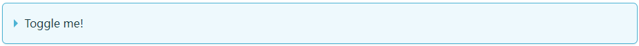

  - 部分展开

    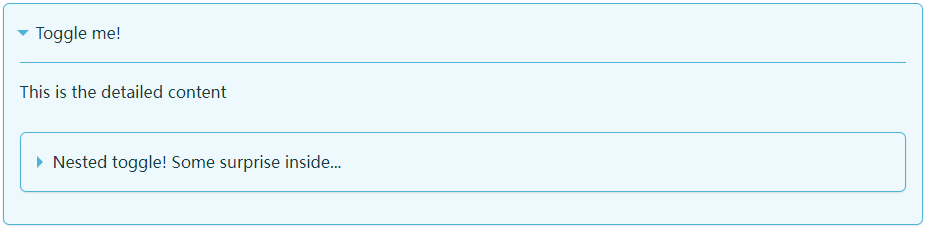

  - 全部展开

    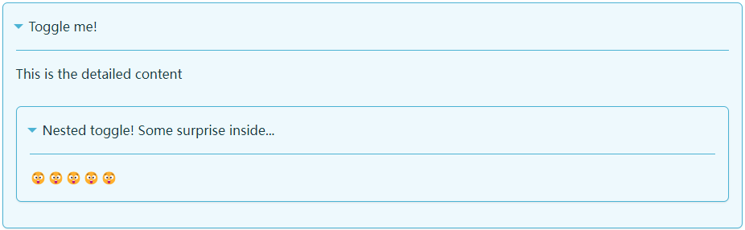


### 2. 高亮文本

- 条件**（已完成）**

  - 导出`Highlight`组件

    在`/src/components/`下建立`Highlight.js`，并粘贴以下代码：

    ```js
    import React from 'react';
    
    export default function Highlight({ children, color }) {
        return (
            <span
                style={{
                    backgroundColor: color,
                    borderRadius: '2px',
                    color: '#fff',
                    padding: '0.2rem',
                }}>
                {children}
            </span>
        );
    }
    ```

  - 修改`/src/theme/MDXComponents`（通过`inject`方式将其`swizzle`到该目录下）下的`index.js`文件

    ```js
    import React from 'react';
    import MDXHead from '@theme/MDXComponents/Head';
    import MDXCode from '@theme/MDXComponents/Code';
    import MDXA from '@theme/MDXComponents/A';
    import MDXPre from '@theme/MDXComponents/Pre';
    import MDXDetails from '@theme/MDXComponents/Details';
    import MDXHeading from '@theme/MDXComponents/Heading';
    import MDXUl from '@theme/MDXComponents/Ul';
    import MDXImg from '@theme/MDXComponents/Img';
    import Admonition from '@theme/Admonition';
    import Mermaid from '@theme/Mermaid';
    import Highlight from '@site/src/components/Highlight';		// 需添加
    const MDXComponents = {
      head: MDXHead,
      code: MDXCode,
      a: MDXA,
      pre: MDXPre,
      details: MDXDetails,
      ul: MDXUl,
      img: MDXImg,
      h1: (props) => <MDXHeading as="h1" {...props} />,
      h2: (props) => <MDXHeading as="h2" {...props} />,
      h3: (props) => <MDXHeading as="h3" {...props} />,
      h4: (props) => <MDXHeading as="h4" {...props} />,
      h5: (props) => <MDXHeading as="h5" {...props} />,
      h6: (props) => <MDXHeading as="h6" {...props} />,
      admonition: Admonition,
      mermaid: Mermaid,
      Highlight: Highlight,										// 需添加
    };
    export default MDXComponents;
    ```

- 语法

  ```markdown
  <Highlight color="#25c2a0">Docusaurus green</Highlight> and <Highlight color="#1877F2">Facebook blue</Highlight> are my favorite colors.
  ```

- 效果

  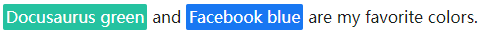


### 3. Tabs

- 修改`/src/theme/MDXComponents`（通过`inject`方式将其`swizzle`到该目录下）下的`index.js`文件**（已完成）**

  ```js
  import React from 'react';
  import MDXHead from '@theme/MDXComponents/Head';
  import MDXCode from '@theme/MDXComponents/Code';
  import MDXA from '@theme/MDXComponents/A';
  import MDXPre from '@theme/MDXComponents/Pre';
  import MDXDetails from '@theme/MDXComponents/Details';
  import MDXHeading from '@theme/MDXComponents/Heading';
  import MDXUl from '@theme/MDXComponents/Ul';
  import MDXImg from '@theme/MDXComponents/Img';
  import Admonition from '@theme/Admonition';
  import Mermaid from '@theme/Mermaid';
  import Highlight from '@site/src/components/Highlight';
  import Tabs from '@theme/Tabs';							// 需添加
  import TabItem from '@theme/TabItem';					// 需添加
  const MDXComponents = {
    head: MDXHead,
    code: MDXCode,
    a: MDXA,
    pre: MDXPre,
    details: MDXDetails,
    ul: MDXUl,
    img: MDXImg,
    h1: (props) => <MDXHeading as="h1" {...props} />,
    h2: (props) => <MDXHeading as="h2" {...props} />,
    h3: (props) => <MDXHeading as="h3" {...props} />,
    h4: (props) => <MDXHeading as="h4" {...props} />,
    h5: (props) => <MDXHeading as="h5" {...props} />,
    h6: (props) => <MDXHeading as="h6" {...props} />,
    admonition: Admonition,
    mermaid: Mermaid,
    Highlight: Highlight,
    Tabs: Tabs,											// 需添加
    TabItem: TabItem,										// 需添加
  };
  export default MDXComponents;
  ```

- 语法

  - 简单使用

    ```markdown
    <Tabs>
      <TabItem value="value" label="label" [default]>
        This is an apple 🍎
      </TabItem>
      <TabItem ...>
      ...
      </TabItem>
      ...
    </Tabs>
    ```

    - `value`：用于识别每一个`TabItem`，最好将每个`TabItem`设置为不同的`value`
    - `label`：显示在 Tab 按钮上的文本
    - `default`【可选】：设置为`default`的`TabItem`将默认显示

  - 同步选项卡

    ```markdown
    <Tabs groupId="operating-systems">
      <TabItem value="win" label="Windows">Use Ctrl + C to copy.</TabItem>
      <TabItem value="mac" label="macOS">Use Command + C to copy.</TabItem>
    </Tabs>
    
    <Tabs groupId="operating-systems">
      <TabItem value="win" label="Windows">Use Ctrl + V to paste.</TabItem>
      <TabItem value="mac" label="macOS">Use Command + V to paste.</TabItem>
    </Tabs>
    ```

    - 通过在`Tabs`标签添加`groupId`属性键值对实现，两组相对应的`TabItem`的`value`属性值应该设置为相同值

  - 不等价同步选项卡

    ```markdown
    <Tabs groupId="operating-systems">
      <TabItem value="win" label="Windows">Use Ctrl + C to copy.</TabItem>
      <TabItem value="mac" label="macOS">Use Command + C to copy.</TabItem>
    </Tabs>
    
    <Tabs groupId="operating-systems">
      <TabItem value="win" label="Windows">Use Ctrl + V to paste.</TabItem>
      <TabItem value="mac" label="macOS">Use Command + V to paste.</TabItem>
    </Tabs>
    
    <Tabs groupId="operating-systems">
      <TabItem value="win" label="Windows">I am Windows.</TabItem>
      <TabItem value="mac" label="macOS">I am macOS.</TabItem>
      <TabItem value="linux" label="Linux">I am Linux.</TabItem>
    </Tabs>
    ```

    - 当选择第三个中的`linux`选项卡时，前两个`Tabs`不会发生变化，将停留在当前所处的状态

- 效果

  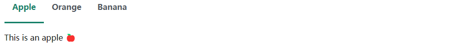


### 4. 代码块

#### 1）代码标题

- 语法

  ````markdown
  ```jsx title="/src/components/HelloCodeTitle.js"
  function HelloCodeTitle(props) {
    return <h1>Hello, {props.name}</h1>;
  }
  ```
  ````

- 效果

  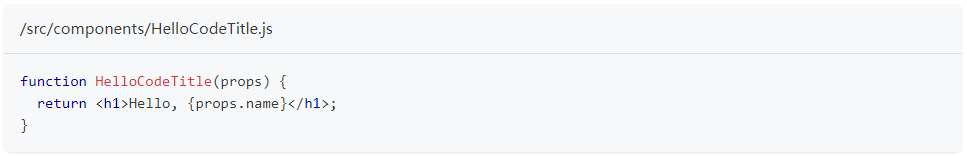


#### 2）主题化

- 修改配置文件`docusaurus.config.js`，主题目录：[dracula 主题](https://github.com/FormidableLabs/prism-react-renderer/blob/master/packages/prism-react-renderer/src/themes/dracula.ts)

  ```js
  module.exports = {
    themeConfig: {
      prism: {
        theme: require('prism-react-renderer/themes/dracula'),
      },
    },
  };
  ```

- 效果

  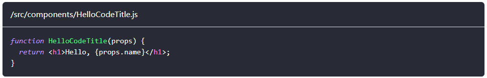


#### 3）高亮行

- 语法

  通过`highlight-next-line`或`highlight-start`、`highlight-end`来注释高亮行

  ````markdown
  ```js
  function HighlightSomeText(highlight) {
    if (highlight) {
      // highlight-next-line
      return 'This text is highlighted!';
    }
  
    return 'Nothing highlighted';
  }
  
  function HighlightMoreText(highlight) {
    // highlight-start
    if (highlight) {
      return 'This range is highlighted!';
    }
    // highlight-end
  
    return 'Nothing highlighted';
  }
  ```
  ````

- 效果

  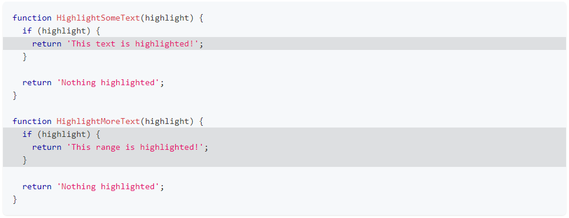

- 支持的注释语法

  | 风格      | 语法                  |
  | --------- | --------------------- |
  | C 风格    | `/* ... */`和`// ...` |
  | JSX 风格  | `{/* ... */}`         |
  | Bash 风格 | `# ...`               |
  | HTML 风格 | `<!-- ... -->`        |


#### 4）自定义魔法注释

- 前提**（已完成）**

  - 在`docusaurus.config.js`中注册一个魔法注释类

    ```js
    module.exports = {
      themeConfig: {
        prism: {
          magicComments: [
            // Remember to extend the default highlight class name as well!
            {
              className: 'theme-code-block-highlighted-line',
              line: 'highlight-next-line',
              block: {start: 'highlight-start', end: 'highlight-end'},
            },
            {													// new
              className: 'code-block-error-line',				// new
              line: 'error-next-line',							// new
              block: { start: 'error-start', end: 'error-end'},	// new
            },													// new
          ],
        },
      },
    };
    ```

  - 在`src/css/custom.css`中添加该类的样式

    ```css
    .code-block-error-line {
      background-color: #ff000020;
      display: block;
      margin: 0 calc(-1 * var(--ifm-pre-padding));
      padding: 0 var(--ifm-pre-padding);
      border-left: 3px solid #ff000080;
    }
    ```

- 使用

  ````markdown
  In JavaScript, trying to access properties on `null` will error.
  
  ```js
  const name = null;
  // error-next-line
  console.log(name.toUpperCase());
  // Uncaught TypeError: Cannot read properties of null (reading 'toUpperCase')
  ```
  
  在C语言中，`/**/`嵌套使用也容易引发错误：
  
  ```c
  int main()
  {
  	int a = 0;
  	printf("%d\n", a);
  	// error-start
  	/*
  	/* just print the value of a */
  	*/
  	// error-end
  	return 0;
  } 
  ```
  ````

- 效果

  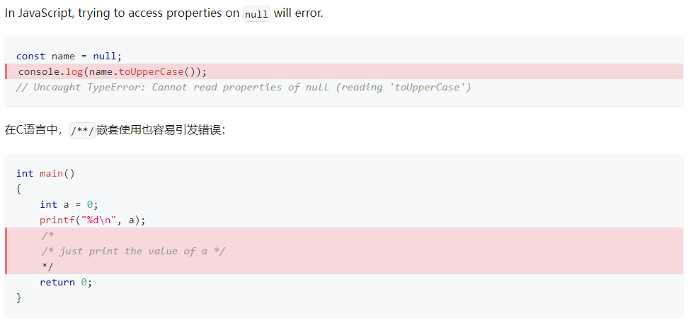


#### 5）行号

- 语法

  ````markdown
  ```jsx {1,4-6,11} showLineNumbers
  import React from 'react';
  
  function MyComponent(props) {
    if (props.isBar) {
      return <div>Bar</div>;
    }
  
    return <div>Foo</div>;
  }
  
  export default MyComponent;
  ```
  ````

  - 在语言元字符串中使用`showLineNumbers`键来为代码块启用行编号

- 效果

  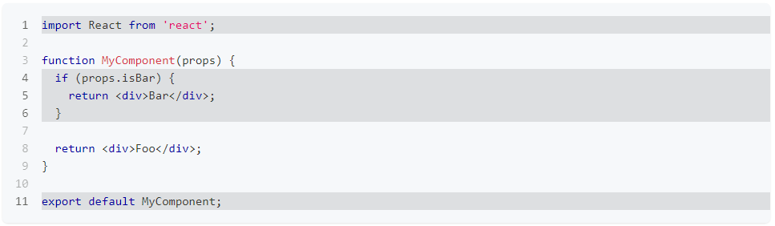


#### 6）活动编辑器

- 前提**（已完成）**

  - 安装插件

    ```bash
    npm install --save @docusaurus/theme-live-codeblock
    ```

  - 修改`docusaurus.config.js`

    ```js
    module.exports = {
      // ...
      themes: ['@docusaurus/theme-live-codeblock'],
      // ...
    };
    ```

- 语法

  ````markdown
  ```jsx live
  function Clock(props) {
    const [date, setDate] = useState(new Date());
    useEffect(() => {
      const timerID = setInterval(() => tick(), 1000);
  
      return function cleanup() {
        clearInterval(timerID);
      };
    });
  
    function tick() {
      setDate(new Date());
    }
  
    return (
      <div>
        <h2>It is {date.toLocaleTimeString()}.</h2>
      </div>
    );
  }
  ```
  ````

  - 在语言元字符串后添加`live`

- 效果

  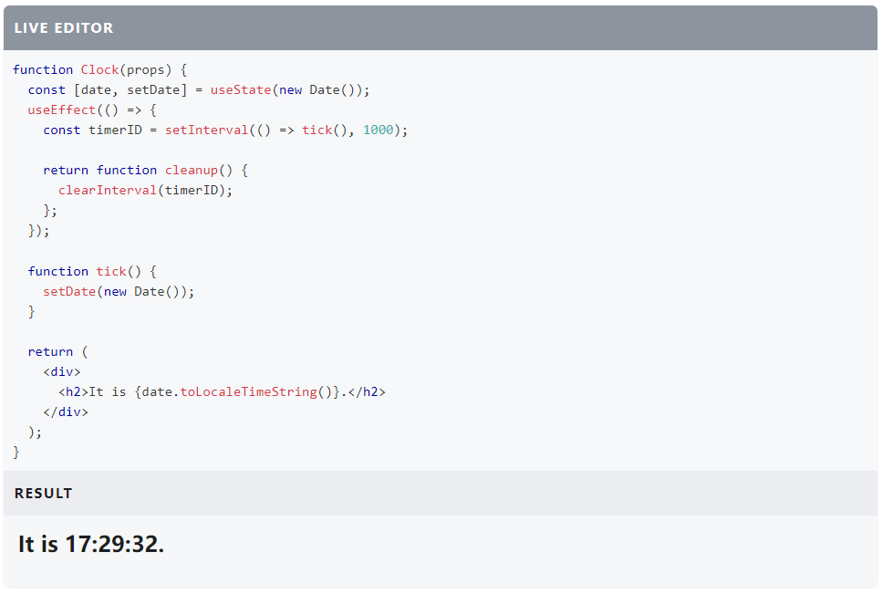


#### 7）在代码块中使用 JSX 标记

- 语法

  ```markdown
  <pre>
  	<b>Input: </b>1 2 3 4{'\n'}
  	<b>Output: </b>"366300745"{'\n'}
  </pre>
  ```

  - 使用`<pre>`标签替代默认代码块格式
  - 在`<pre>`中换行符必须显示编写

- 效果

  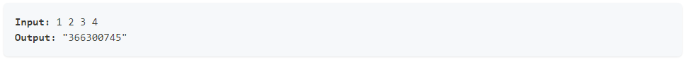


### 5. Note

- 语法

  ```markdown
  :::[class] [title]
  text
  :::
  ```

  - `class`：`Note`的类别。（`note`、`tip`、`info`、`caution`、`danger`）
  - `title`【可选】：Note 的标题，默认标题将使用`class`的值。

- 效果

  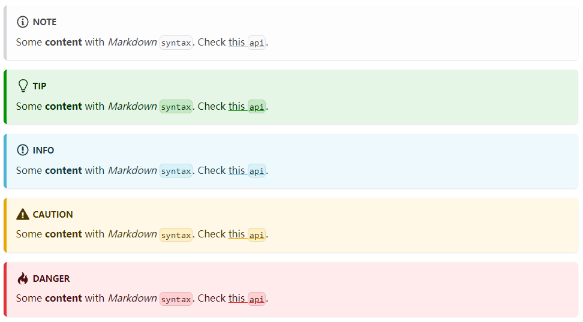


### 6. 设置标题 ID

- 语法

  ```markdown
  ### Hello World {#my-explicit-id}
  ```

- 效果

  该标题的 ID 将修改为`my-explicit-id`并将用于生成网页链接

